## Landing Page UI Design

El diseño de la interfaz de usuario de la landing page se desarrolló a partir de las decisiones definidas en la arquitectura de información, asegurando una estructura clara y centrada en el usuario. En base a ello, se diseñó una interfaz coherente, aplicando una paleta de colores suaves. Además, se tomó en cuenta la experiencia del usuario garantizando accesibilidad, facilidad de uso y la adaptación a distintos dispositivos.

### Landing Page Wireframe

#### Landing Page para Desktop Web Browser

En este apartado se describe la estructura del sitio de nuestro proyecto con el fin de proporcionar una visión más clara del contenido que estará disponible en la plataforma.

* **Header (Encabezado):** Ubicado en la parte superior, contiene el logotipo y el menú de navegación (Home, Beneficios, Testimonios, Planes). Su función es permitir el acceso rápido a las secciones principales sin perder el contexto.
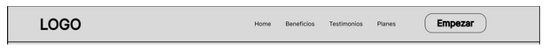

* **Sección Principal:** Es la primera sección visible. Incluye un mensaje principal, una breve descripción y un botón CTA como “Prueba Demo”. Su función es captar la atención del usuario e interactuar con la plataforma.
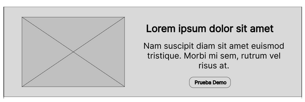

* **Sección de Beneficios:** Presenta las ventajas principales del sistema (monitoreo en tiempo real, seguridad, tecnología médica).
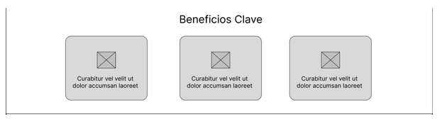

* **Sección de Testimonios:** Muestra las experiencias de usuarios como padres o pediatras. Su función es generar confianza a otros usuarios.
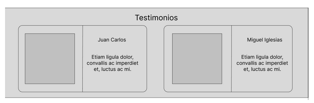

* **Sección de Precio y Planes:** Se detallan los distintos tipos de suscripciones disponibles para el usuario. Su función es permitir al usuario comparar los diferentes planes.
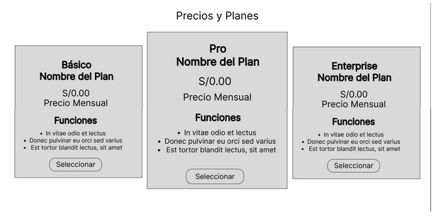

* **Sección Capturas de Pantalla:** Se muestran evidencias visuales del uso de nuestra aplicación. Su función es informar al usuario de cómo se emplea nuestra aplicación.
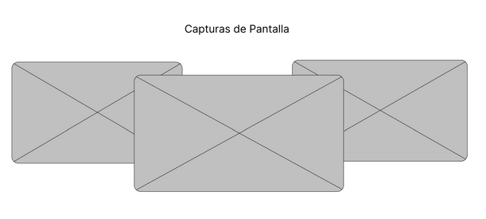

* **Sección Desarrolladores:** Se mostrarán los encargados de haber desarrollado la aplicación.
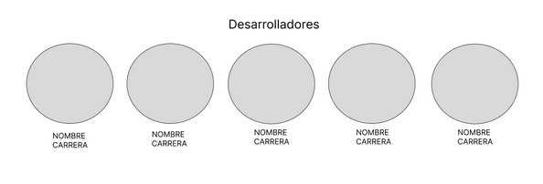

* **Footer:** Contiene información adicional como contactos, enlaces secundarios o derechos de autor. Su función es cerrar la navegación y ofrecer información complementaria.
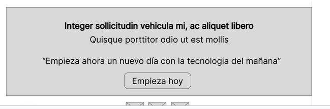

#### Landing Page para Mobile Web Browser

* **Header:** Incluye el logotipo y un menú tipo hamburguesa. Su función es optimizar el espacio y mantener la navegación accesible.
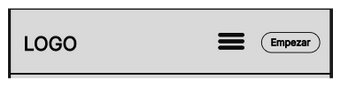

* **Sección Principal adaptada:** Se presenta un mensaje clave sobre el sistema, acompañada de una imagen referencial y un botón de acción.
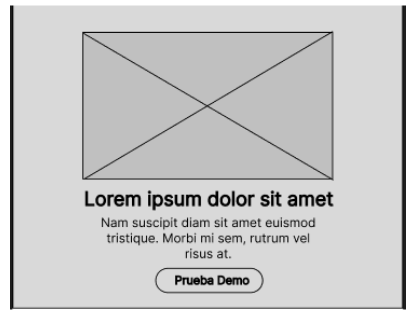

* **Sección Beneficios:** Presenta las principales ventajas del sistema en formato vertical mediante tarjetas.
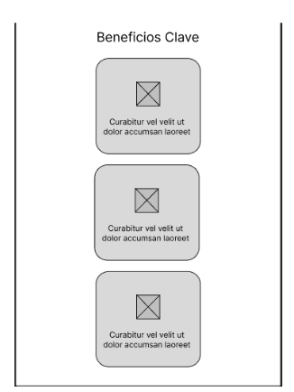

* **Sección de Testimonios:** Muestra experiencias de usuarios que han utilizado el sistema. Su función es generar confianza mediante opiniones en formato vertical.
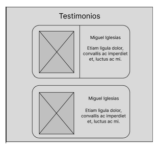

* **Sección de Precio y Planes:** Presenta los planes de suscripción disponibles en formato vertical. Su función es permitir al usuario comparar opciones y elegir la más adecuada.
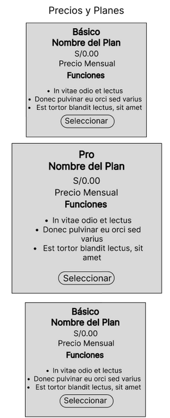

* **Sección Capturas de Pantalla:** Se muestran evidencias visuales del uso de nuestra aplicación adaptadas a pantallas pequeñas.
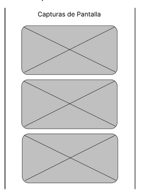

* **Sección Desarrolladores:** Se mostrarán los encargados de haber desarrollado la aplicación en formato de lista o tarjetas apiladas.
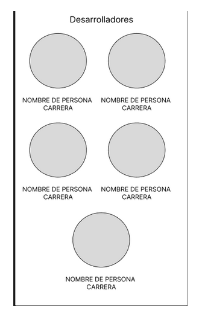

* **Sección Footer:** Sección final con información complementaria, enlaces y año de creación, adaptada al ancho del dispositivo.
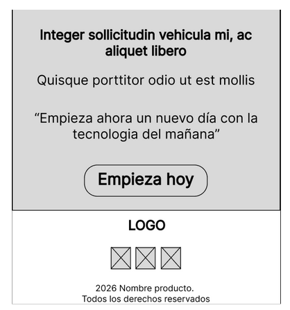

---

### Landing Page Mock-up

#### Landing Page para Desktop Web Browser

* **Sección Encabezado:** Presenta un diseño limpio de fondo blanco, logotipo de SIRAN en tonos azules ubicado en la parte izquierda y el menú de navegación en la derecha (Home, Beneficios, Testimonios y Planes), acompañado del botón destacado.
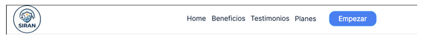

* **Sección Principal:** Sección destacada con fondo grisáceo, un título principal en tipografía Poppins, textos descriptivos en tipografía Roboto y un botón en azul. Se incluye una imagen representativa.
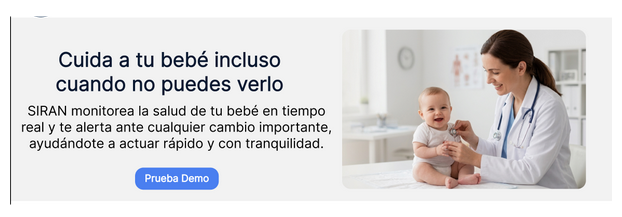

* **Sección Beneficios:** Se organiza en columnas con tarjetas que contienen iconos, título y descripciones cortas, utilizando un fondo azul lavanda en las tarjetas y un fondo blanco principal.
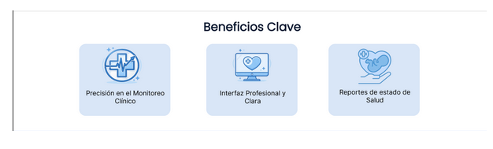

* **Sección Testimonios:** Tarjetas con fondo celeste pastel que contienen opiniones de usuarios, nombres e imágenes.

* **Sección Planes:** Tarjetas alineadas horizontalmente que presentan los planes de suscripción, con precios, características y botones. Se destaca un plan con un color diferente.
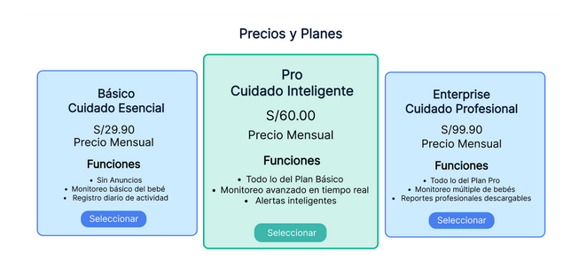

* **Sección Capturas de Pantalla:** Presentaciones visuales de nuestra aplicación interactuando con diferentes usuarios como pediatras o padres.
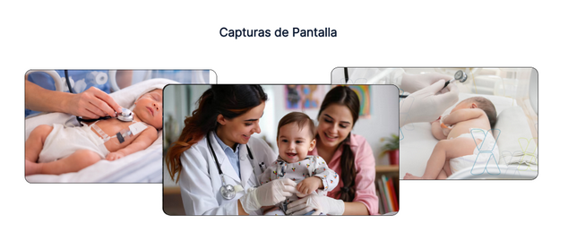

* **Sección Desarrolladores:** Se muestran a los encargados de haber desarrollado la aplicación con sus respectivos perfiles.

* **Sección Footer:** Sección final con fondo blanco y celeste pastel, que incluye información adicional, enlaces, derechos de autor y accesos a redes sociales como Instagram y Facebook.
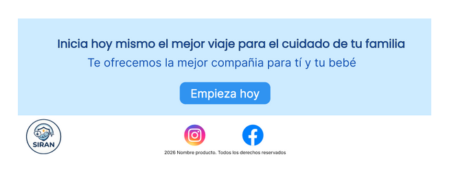

#### Landing Page para Mobile Web Browser

* **Sección Encabezado:** Presenta un diseño de fondo blanco, el logotipo de SIRAN alineado al centro, un menú de hamburguesa alineado al lado izquierdo y por último un botón interactivo.
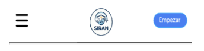

* **Sección Principal:** Se presenta en formato vertical con fondo en tonos grisáceos, un título destacado, texto breve y un botón CTA en azul.
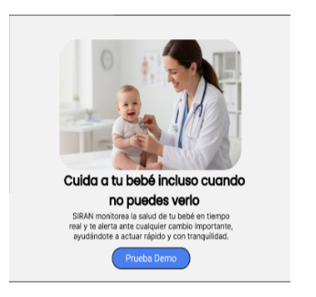

* **Sección Beneficios:** Organizada en tarjetas verticales con fondo blanco, cada una con icono, título y breve descripción.
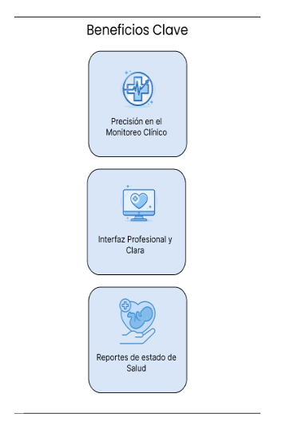

* **Sección Testimonios:** Tarjetas verticales con fondo celeste pastel, que contienen opiniones de usuarios con texto breve.
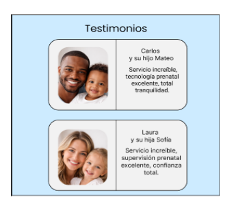

* **Sección Planes:** Tarjetas organizadas verticalmente con información de precios, características y botones de color azul brillante destacados. Destaca la tarjeta del centro con un fondo de color cian pastel.
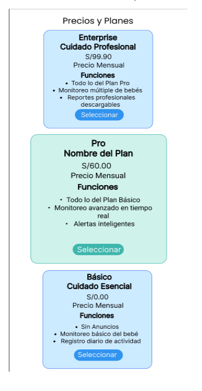

* **Sección Capturas de Pantalla:** Evidencia visual del uso de nuestra aplicación y cómo los usuarios (pediatras o padres) la manejan desde sus dispositivos.

* **Sección Desarrolladores:** Se presenta mediante tarjetas con fondo blanco, donde se muestran los integrantes del equipo, incluyendo foto y nombre. Se mantiene el uso de colores suaves alineados a la identidad visual.
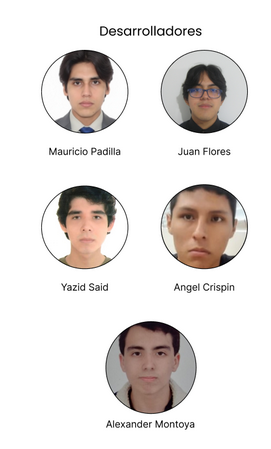

* **Sección Footer:** Presenta un diseño estructurado con fondo blanco y celeste pastel permitiendo diferenciarse del resto de secciones. Se organiza en bloques verticales, incluyendo enlaces de navegación y datos de contacto. Puede incorporar el logotipo en menor tamaño, acompañado de textos secundarios y enlaces útiles.
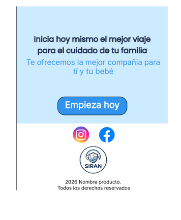