## Web Applications UX/UI Design

### Web Applications Wireframes

En esta sección se presentan los esquemas visuales de baja fidelidad (wireframes) del sistema SIRAN. Estos diseños tienen como propósito establecer la estructura de información, la jerarquía de los elementos críticos y el flujo de navegación entre los módulos principales, tales como el registro de datos clínicos, la gestión de alertas en tiempo real y el panel de seguimiento neonatal.

* **Login y Register:** Interfaz de acceso y creación de cuenta, estructurada con campos de texto claros, jerarquía visual para las llamadas a la acción (CTA) y opciones de recuperación de credenciales.
    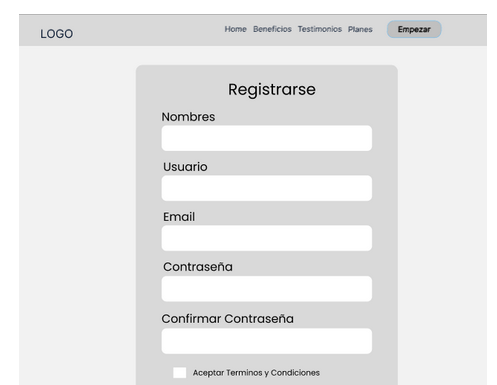

* **Dashboard Principal (Padres):** Vista general que prioriza los últimos signos vitales registrados (temperatura y oxígeno), estado de alerta actual del neonato y accesos rápidos a módulos de alimentación y reportes.
    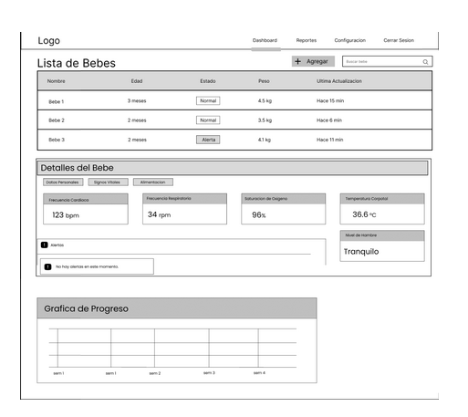

* **Panel de Control (Médicos):** Listado de neonatos asignados con indicadores visuales de criticidad para priorizar la revisión de reportes y alertas.
    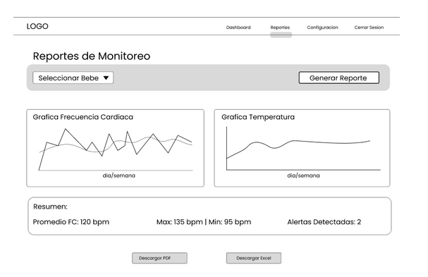

* **Agregar Bebé:** Formulario estructurado para el alta de un "Neonatal Profile", organizando los campos de datos antropométricos iniciales (peso al nacer, edad gestacional) en pasos lógicos.
    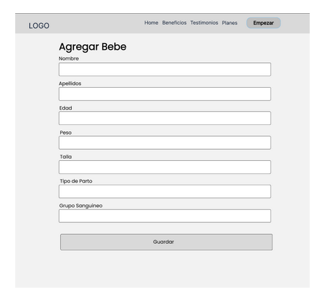

* **Profile / Perfil (Web y Móvil):** Pantalla de gestión de cuenta de usuario, mostrando la información personal, roles y configuración de la cuenta, con adaptación de diseño vertical para la versión móvil.
    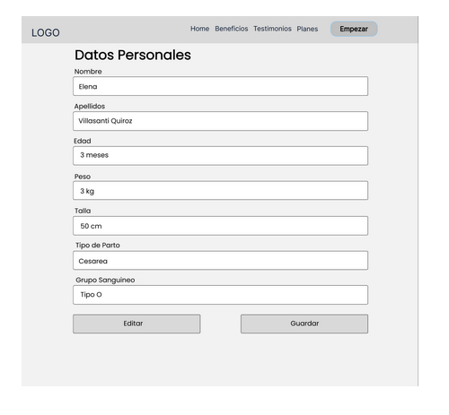

* **Sección de Alimentación:** Interfaz intuitiva y amigable para el registro rápido de tomas (leche materna o fórmula), incluyendo selectores de tiempo y cantidad para facilitar la tarea a padres agotados.
    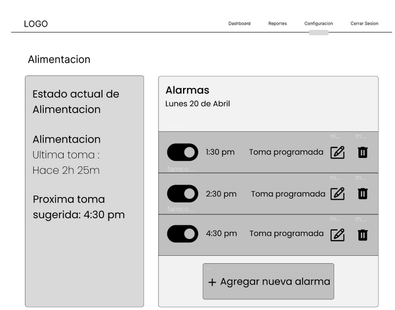

* **Reporte Monitoreo:** Estructura del documento clínico, con espacios designados para gráficas de tendencias históricas y resúmenes estadísticos.
    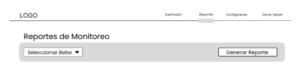

---

### Web Applications Wireflow Diagrams

Los wireflows combinan la estructura de los wireframes con flechas de flujo para representar cómo el usuario navega a través de la aplicación web y móvil para completar tareas específicas.

* **User Goal 1: Como usuario nuevo quiero poder registrarme.**
    Describe el camino desde la Landing Page hacia el formulario de creación de cuenta, validación de datos y la pantalla de bienvenida.
    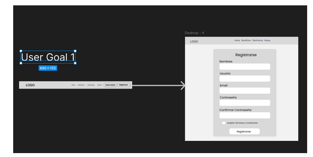

* **User Goal 2: Como usuario registrado quiero poder iniciar sesión.**
    Muestra el flujo de autenticación, incluyendo la recuperación de contraseña y el redireccionamiento al Dashboard correspondiente según el rol (Padre o Médico).
    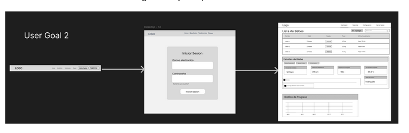

* **User Goal 3: Como usuario registrado quiero poder agregar otro bebé más.**
    Representa el flujo dentro del perfil de cuidador para dar de alta un nuevo "Neonatal Profile", ingresando datos como peso al nacer y edad gestacional.
    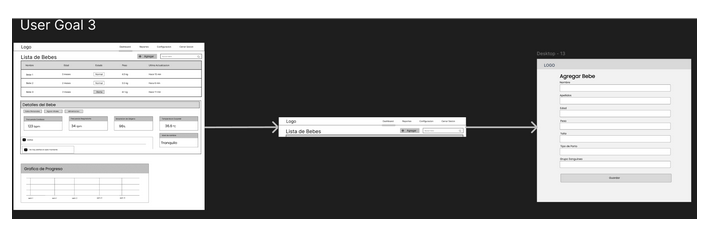

* **User Goal 4: Como usuario registrado, quiero poder entrar en la sección de configuración para editar mi perfil.**
    Muestra el acceso al menú de cuenta, la edición de datos personales y la confirmación de cambios tanto en entorno web como móvil.
    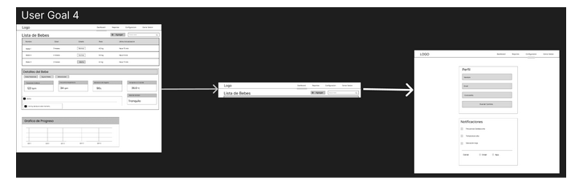

---

### Web Applications Mock-ups

Los mock-ups de alta fidelidad integran la identidad visual de SIRAN: el uso de la tipografía Poppins para jerarquías claras, Roboto para la legibilidad de datos clínicos y una paleta de colores que transmite serenidad y rigor médico.

* **Login, Register y Profile:** Pantallas limpias con el fondo #F2F2F2 (Blanco grisáceo), inputs accesibles y el uso del color #4A7FF0 (Azul brillante) para los botones principales, asegurando una experiencia de registro e inicio de sesión sin estrés.
    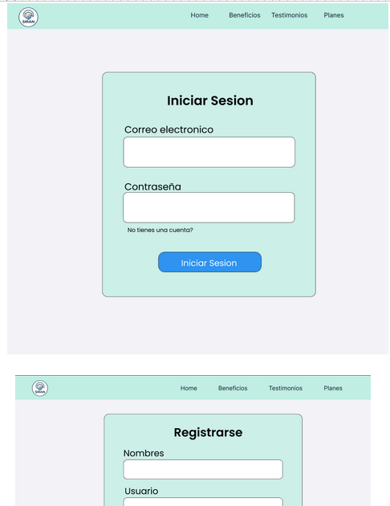

* **Dashboard y Sección de Alimentación:** Interfaz de monitoreo y registro diario. Se emplean tarjetas con esquinas redondeadas y espacios amplios. Para las acciones cotidianas como registrar alimentación, se usa un diseño amigable que reduce la carga cognitiva.
    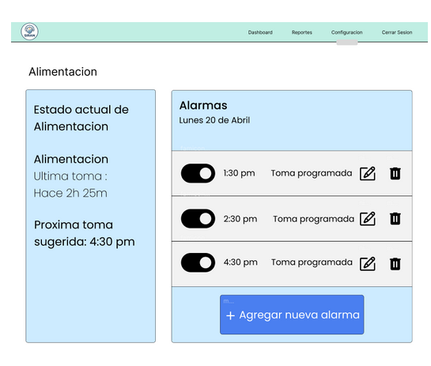

* **Agregar Bebé:** Formulario paso a paso con indicadores visuales de progreso, utilizando la paleta #E3EDFF (Azul lavanda pálido) para zonas de información o ayuda contextual.
    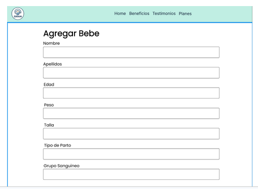

* **Reporte Monitoreo:** Presentación estética de gráficas de tendencias utilizando fondos blancos (#FFFFFF) para maximizar el contraste de los datos de salud. Los estados óptimos se muestran en tonos azules, mientras que las advertencias resaltan claramente.
    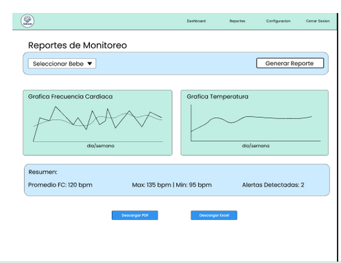

---

### Web Applications User Flow Diagrams

Los diagramas de flujo de usuario detallan la lógica de decisión y los pasos técnicos detrás de cada interacción en la plataforma.

* **User Goal 1: Registro de usuario.**
    Inicio -> Ingreso de datos -> ¿Datos válidos? -> (No: Mostrar error) -> (Sí: Crear cuenta) -> Redirección a Home -> Fin.
    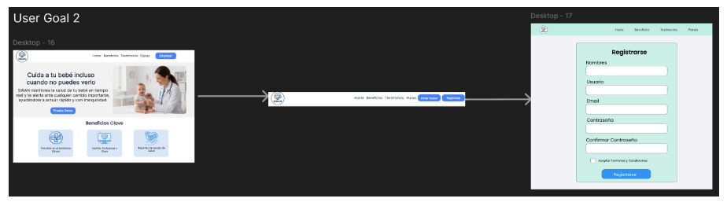

* **User Goal 2: Inicio de sesión.**
    Inicio -> Ingreso de credenciales -> Verificación en BD -> ¿Acceso concedido? -> (No: Notificar error) -> (Sí: Cargar Dashboard según rol) -> Fin.
    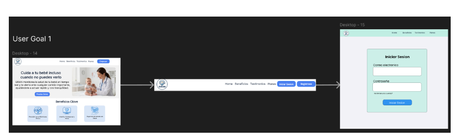

* **User Goal 3: Agregar otro bebé.**
    Dashboard -> Click "Añadir Neonato" -> Formulario de perfil -> Validación de campos obligatorios -> ¿Formulario completo? -> (No: Marcar campos requeridos) -> (Sí: Guardar registro) -> Fin.
    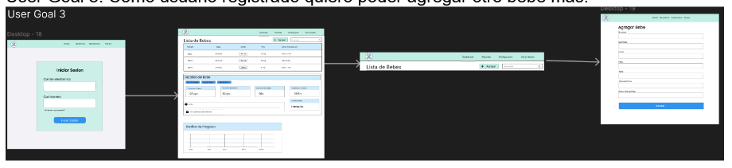

* **User Goal 4: Editar perfil.**
    Menú -> Configuración -> Cargar datos actuales -> Modificar campos -> Guardar -> Actualización en base de datos -> Confirmación visual -> Fin.
    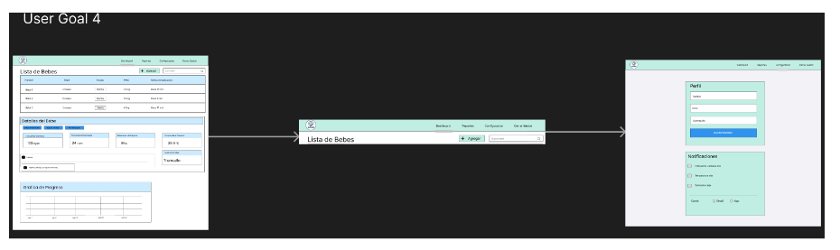
