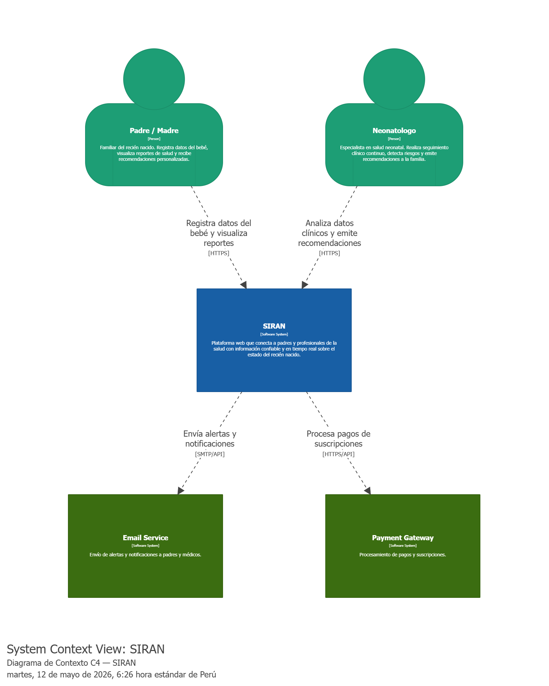
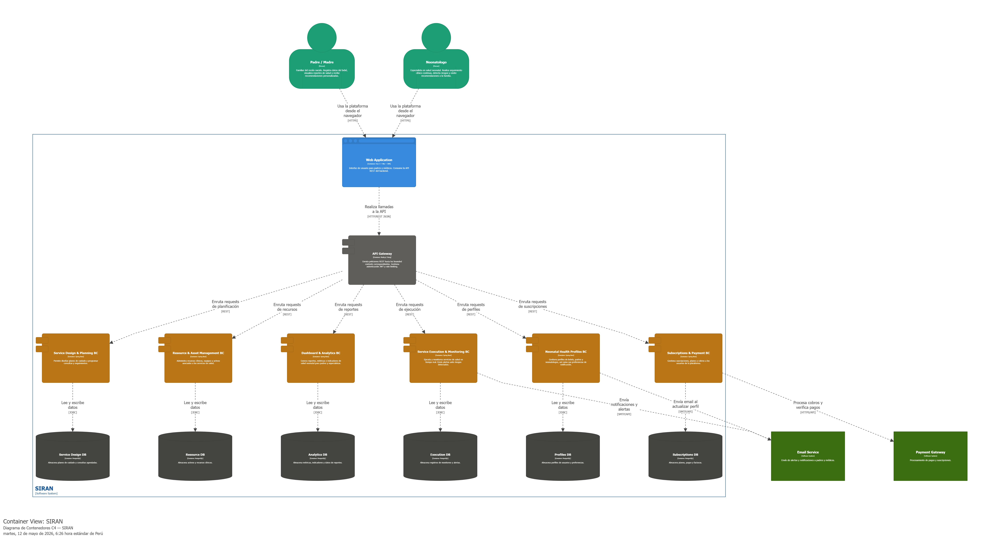
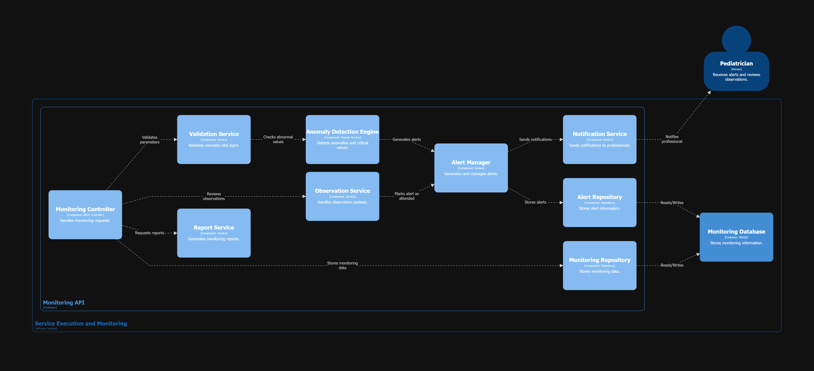

## 4.6. Domain-Driven Software Architecture

La arquitectura de software orientada al dominio en SIRAN es un enfoque de diseño estratégico que organiza la estructura del sistema en torno a los procesos críticos del cuidado neonatal. Este enfoque nos permite desarrollar una plataforma que refleja con exactitud la lógica clínica y los protocolos médicos de monitoreo, facilitando la implementación de funciones esenciales como los algoritmos de validación y la detección de señales de alerta temprana. Al centrar el diseño en el dominio de la salud infantil, garantizamos un sistema coherente, escalable y robusto, capaz de adaptarse a las normativas médicas cambiantes y de ofrecer una herramienta de mantenimiento sencillo que responde con precisión a los requisitos de seguridad y confiabilidad que el sector salud exige.

### 4.6.1. Design-Level Event Storming

La sesión de Design-Level Event Storming tuvo como propósito profundizar en el análisis del dominio y estructurar de manera detallada los componentes principales del sistema, tales como actores, comandos, eventos, políticas y agregados. Mediante una dinámica colaborativa desarrollada en Miro, se identificaron y organizaron los flujos esenciales del negocio, así como los distintos Bounded Contexts, permitiendo establecer una base sólida para el diseño arquitectónico de la solución.

### 4.6.2. Software Architecture Context Diagram

El Diagrama de Contexto proporciona una visión de alto nivel del sistema SIRAN, detallando sus interacciones con los usuarios externos (Padres y Neonatólogos) y otros sistemas de soporte o servicios externos necesarios para la operación.

 

### 4.6.3. Software Architecture Container Diagrams

Este diagrama ilustra la arquitectura técnica de alto nivel, mostrando los contenedores principales como la Aplicación Web, la API Backend y la Base de Datos, detallando cómo se comunican entre sí para soportar los distintos Bounded Contexts.

 

### 4.6.4. Software Architecture Components Diagrams

En esta sección se detalla la estructura interna de los contenedores, especificando los componentes lógicos que gestionan los procesos de monitoreo, validación de signos vitales y el motor de alertas inteligentes de SIRAN.

Neonatal Health Profiles BC:

Service Execution and Neonatal Monitoring BC:

  

