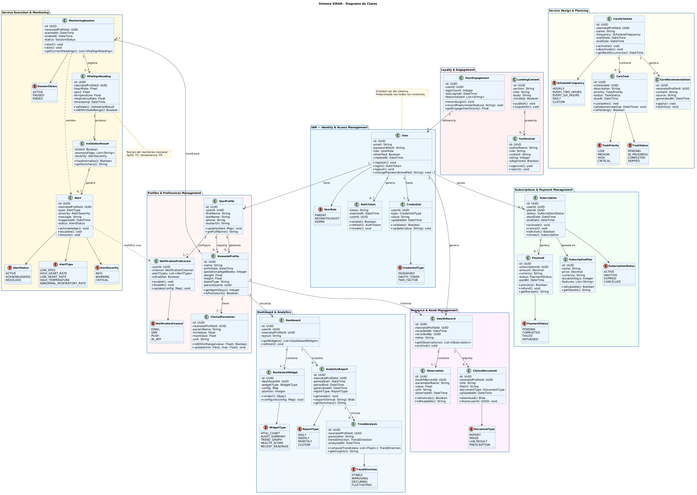

## Software Object-Oriented Design

La implementación de un diseño orientado a objetos será una pieza clave para el éxito del proyecto. Gracias a este enfoque, podremos organizar el sistema mediante módulos escalables, utilizando pilares como la herencia y el polimorfismo para garantizar que el código sea mantenible y fácil de reutilizar.

### Class Diagrams

El Diagrama de Clases proporciona una representación visual de la estructura lógica y estática del sistema SIRAN. En él se definen las clases fundamentales que componen el dominio, tales como Neonato, Medico, Padre, Alerta y RegistroSalud, detallando sus atributos, métodos y tipos de datos.

Este diagrama establece los vínculos de asociación, agregación y composición que permiten la comunicación entre los distintos módulos del software. Al aplicar principios de diseño orientado a objetos, aseguramos que la arquitectura sea lo suficientemente flexible para integrar nuevas reglas de validación clínica y escalar el sistema de monitoreo de manera eficiente, manteniendo una separación clara de responsabilidades entre las entidades del negocio.

