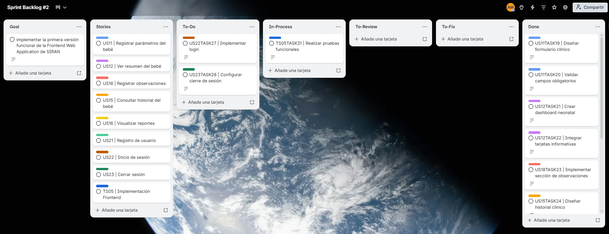
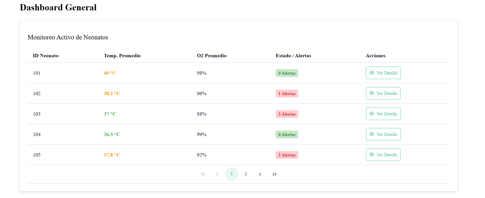
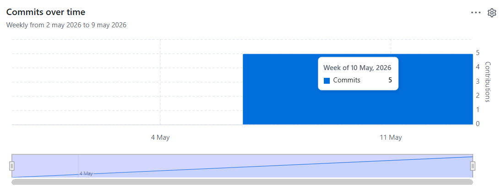
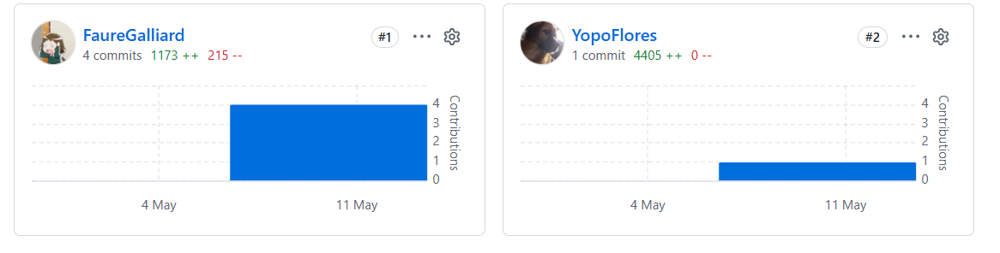

###  Sprint 2

En esta sección se presenta la documentación correspondiente al Sprint 2 del proyecto SIRAN. Durante esta iteración, el equipo se enfocó en el desarrollo de la Frontend Web Application del sistema, implementando las primeras funcionalidades relacionadas con la gestión y visualización de información neonatal.

El Sprint 2 estuvo orientado a construir las interfaces principales de interacción para padres y especialistas neonatales, priorizando la experiencia de usuario, navegación interna, formularios de registro clínico y visualización de información médica relevante.


#### Sprint Planning 2

| Sprint # | Sprint 2 |
|---|---|
| **Sprint Planning Background** |  |
| Date | 2026-05-09 |
| Time | 09:30 PM |
| Location | Virtual (Discord) |
| Prepared By | Montoya Torres, Alexander Gabriel |
| Attendees (to planning meeting) | Montoya Torres, Alexander Gabriel / Padilla Merino, Mauricio Jared / Flores Rios, Juan Diego / Crispin Valdivia, Angel Gabriel /Jose Gabriel Rudas Chavarria  / Sebastian Becerra |
| Sprint 1 Review Summary | Durante el Sprint 1 se implementó exitosamente la Landing Page informativa de SIRAN, incluyendo navegación responsive, secciones institucionales, testimonios, planes y despliegue inicial utilizando GitHub Pages. |
| Sprint 1 Retrospective Summary | El equipo identificó una buena organización del trabajo colaborativo mediante GitFlow y GitHub. Como mejora, se acordó optimizar la distribución de tareas frontend y reforzar las pruebas visuales antes de integrar cambios a la rama develop. |
| Sprint Goal & User Stories | |
| Sprint 2 Goal | Nuestro objetivo es implementar la primera versión funcional de la Frontend Web Application de SIRAN, permitiendo a los usuarios registrar información neonatal, visualizar datos relevantes y navegar entre las principales funcionalidades del sistema mediante una interfaz intuitiva y responsive. |
| Sprint 2 Velocity | 22 Story Points |
| Sum of Story Points | 22 Story Points |


####  Aspect Leaders and Collaborators

En esta sección se presenta la Leadership-and-Collaboration Matrix (LACX) correspondiente al Sprint 2. Durante esta iteración, el enfoque principal estuvo orientado al desarrollo de la Frontend Web Application de SIRAN y la integración inicial de funcionalidades relacionadas con monitoreo neonatal.

### Principales Aspectos Considerados en el Sprint

#### Frontend Web Application

Comprende el diseño e implementación de interfaces interactivas para el registro de parámetros del bebé, visualización de historial clínico, reportes y navegación interna del sistema.

#### UI/UX & Responsive Design

Incluye la optimización visual, experiencia de usuario, accesibilidad y adaptación responsive de las vistas implementadas.

#### Deployment & Repository Management

Incluye integración de cambios mediante GitFlow, control de versiones y despliegue incremental de la aplicación frontend.

| Team Member (Last Name, First Name) | GitHub Username | Landing Page (L/C) | Services (L/C) | Applications (L/C) | Deployment (L/C) |
|---|---|---|---|---|---|
| Montoya Torres, Alexander Gabriel | gabrielito4334 | C | C | L | C |
| Padilla Merino, Mauricio Jared | MauricioPadilla07 | C | C | C | C |
| Flores Rios, Juan Diego | YopoFlores | L | C | C | C |
| Crispin Valdivia, Angel Gabriel | FaureGalliard | C | C | C | L |
| Rudas Chavarria, Jose Gabriel | josegabriel1604 | C | L | C | C |
| Becerra, Sebastian | sebasdev28 | C | C | C | C |


####  Sprint Backlog 2

El Sprint Backlog 2 se centra en el desarrollo inicial de la Frontend Web Application de SIRAN, priorizando funcionalidades relacionadas con el registro y visualización de información neonatal. Durante este Sprint, el equipo implementó interfaces funcionales para padres y especialistas, integrando formularios, dashboards y navegación interna.

A continuación, se detallan las User Stories y las Tasks asignadas a cada miembro del equipo.

| **User Story Id** | **User Story Title** | **Task Id** | **Task Title** | **Description** | **Estimation (Hours)** | **Assigned To** | **Status** |
|---|---|---|---|---|---|---|---|
| HU11 | Registrar parámetros del bebé | T-19 | Diseñar formulario clínico | Implementar formulario para registrar parámetros neonatales | 4 | Alexander | Done |
| HU11 | Registrar parámetros del bebé | T-20 | Validar campos obligatorios | Agregar validaciones para datos clínicos requeridos | 3 | Alexander | Done |
| HU12 | Ver resumen del bebé | T-21 | Crear dashboard neonatal | Implementar vista resumen con indicadores principales | 4 | Juan Diego | Done |
| HU12 | Ver resumen del bebé | T-22 | Integrar tarjetas informativas | Mostrar métricas relevantes del bebé mediante cards | 2 | Angel Gabriel | Done |
| HU18 | Registrar observaciones | T-23 | Implementar sección de observaciones | Crear módulo para registrar observaciones médicas | 3 | Alexander | Done |
| HU15 | Consultar historial del bebé | T-24 | Diseñar historial clínico | Implementar vista cronológica de registros | 4 | Juan Diego | Done |
| HU16 | Visualizar reportes | T-25 | Implementar vista de reportes | Crear interfaz gráfica para reportes médicos | 3 | Juan Diego | Done |
| HU21 | Registro de usuario | T-26 | Diseñar formulario de registro | Implementar interfaz de registro de usuarios | 3 | Angel Gabriel | Done |
| HU22 | Inicio de sesión | T-27 | Implementar login | Crear formulario de autenticación de usuarios | 3 | Angel Gabriel | To-do |
| HU23 | Cerrar sesión | T-28 | Configurar cierre de sesión | Implementar opción de logout y redirección | 2 | Alexander | To-do |
| TS05 | Implementación Frontend | T-29 | Configurar estructura frontend | Organizar componentes y carpetas del proyecto | 3 | Juan Diego | Done |
| TS05 | Implementación Frontend | T-30 | Integrar estilos responsive | Optimizar vistas para desktop y móviles | 3 | Angel Gabriel | Done |
| TS05 | Implementación Frontend | T-31 | Realizar pruebas funcionales | Verificar navegación y funcionamiento de vistas | 2 | Alexander | In-process |



URL: https://trello.com/invite/b/6a033ee9a0cb9740dc1eed1c/ATTI29046ef8bf1d80abbb33aa03382df3fa64095774/sprint-backlog-2 


####  Development Evidence for Sprint Review

En esta sección se presenta la evidencia del desarrollo realizado durante el Sprint 2 del proyecto SIRAN. Durante esta iteración, el equipo se enfocó principalmente en la implementación de la Frontend Web Application, incorporando funcionalidades orientadas al monitoreo y gestión de información neonatal.

El desarrollo de la aplicación frontend se realizó utilizando HTML, CSS y JavaScript, manteniendo una arquitectura ligera, modular y responsive. Asimismo, se utilizó GitHub para el control colaborativo de versiones y Visual Studio Code como entorno principal de desarrollo.

Durante este Sprint se implementaron las siguientes funcionalidades:

- Formularios de registro de parámetros neonatales
- Dashboard de resumen clínico
- Historial de registros médicos
- Módulo de observaciones
- Formularios de autenticación
- Navegación interna de la aplicación
- Diseño responsive y mejoras visuales

El equipo continuó utilizando una estrategia GitFlow simplificada, desarrollando funcionalidades en ramas feature antes de integrarlas en la rama develop.

| **Repository** | **Branch** | **Commit Id** | **Commit Message** | **Commit Message Body** | **Committed on (Date)** |
|---|---|---|---|---|---|
| WebBuilders2610/WebApplication | develop | a31fd12 | feat: implement dashboard structure | Added initial frontend structure and dashboard layout for SIRAN application | 2026-05-11 |
| WebBuilders2610/WebApplication | feature/neonatal-health-profiles | b72ad44 | feat: add neonatal registration form | Implemented form for neonatal parameter registration with validations | 2026-05-11 |
| WebBuilders2610/WebApplication | feature/dashboard-main-view | c19de52 | feat: implement neonatal dashboard | Added dashboard cards and summary metrics visualization | 2026-05-11 |
| WebBuilders2610/WebApplication | develop | f90aa17 | style: improve responsive application layout | Improved responsive behavior for mobile and tablet devices | 2026-05-11 |
| WebBuilders2610/WebApplication | develop | g32bd91 | fix: correct navigation and forms | Fixed navigation issues and form alignment problems | 2026-05-11 |


#### Execution Evidence for Sprint Review

Durante el Sprint 2, el equipo logró implementar exitosamente la primera versión funcional de la Frontend Web Application de SIRAN, permitiendo gestionar información neonatal mediante interfaces interactivas y accesibles.

La aplicación frontend desarrollada incluye funcionalidades orientadas tanto a padres como especialistas neonatales, permitiendo registrar información clínica, visualizar reportes y consultar historial médico de manera organizada.

Las principales funcionalidades implementadas fueron:

- Registro de parámetros neonatales
- Dashboard clínico con indicadores
- Historial de registros médicos
- Gestión de observaciones
- Registro e inicio de sesión de usuarios
- Navegación interna responsive

A continuación, se presentan capturas de pantalla de las principales vistas implementadas durante el Sprint:

**Vista Dashboard Principal**




####  Services Documentation Evidence for Sprint Review

Durante el Sprint 2 no se implementaron Web Services RESTful completos, debido a que el enfoque principal estuvo orientado al desarrollo de la Frontend Web Application de SIRAN.

Sin embargo, se definieron las estructuras iniciales y contratos funcionales necesarios para futuras integraciones backend relacionadas con:

- Registro de parámetros clínicos
- Gestión de historial neonatal
- Generación de alertas inteligentes
- Autenticación de usuarios

La documentación OpenAPI y especificación formal de endpoints será desarrollada en los siguientes Sprints, cuando se implemente la capa de servicios RESTful.


#### Software Deployment Evidence for Sprint Review

Durante el **Sprint 2**, el equipo realizó el despliegue incremental de la **Frontend Web Application** de SIRAN utilizando **Vercel** como plataforma de hosting y despliegue continuo.

La estrategia de despliegue permitió validar continuamente las funcionalidades implementadas, facilitando las pruebas colaborativas y la integración constante de cambios realizados por el equipo de desarrollo.

### Estrategia de despliegue implementada

Se utilizó una estrategia basada en:

- GitHub
- Vercel
- Integración mediante rama `release`
- Flujo GitFlow simplificado
- Automatización de despliegues continuos

### Proceso realizado

#### 1. Configuración del repositorio frontend

- Se creó el repositorio destinado a la Frontend Web Application.
- Se configuró el control de versiones utilizando Git y GitHub.
- Se organizó el flujo de trabajo mediante ramas `feature`, `develop` y `release`.

#### 2. Desarrollo e integración continua

- Las funcionalidades fueron desarrolladas en ramas `feature`.
- Posteriormente se integraron en la rama `develop`.
- Una vez validadas, las funcionalidades fueron fusionadas en la rama `release` para su despliegue en producción.

#### 3. Configuración de Vercel

- Se vinculó el repositorio del proyecto con la plataforma Vercel.
- Se configuró la rama `release` como rama principal de despliegue.
- Vercel detectó automáticamente la aplicación frontend y generó el proceso de build y publicación.

#### 4. Publicación de la aplicación

- Cada actualización realizada en la rama `release` generó automáticamente un nuevo despliegue.
- Se realizaron pruebas de funcionamiento y visualización en navegadores modernos y dispositivos móviles.
- Se verificó la correcta navegación entre vistas y componentes del sistema.

URL de despliegue:

[https://neonatal-care-coordination.vercel.app/](https://neonatal-care-coordination.vercel.app/)


####  Team Collaboration Insights during Sprint

Durante el **Sprint 2**, el equipo de SIRAN mantuvo una colaboración activa enfocada en el desarrollo de la **Frontend Web Application**. La organización del trabajo permitió distribuir eficientemente las tareas relacionadas con formularios clínicos, dashboards, navegación y diseño responsive.

### Metodología de trabajo colaborativo

El equipo continuó utilizando una estrategia basada en **GitFlow simplificado**, donde:

- La rama `main` almacenó versiones estables del proyecto
- La rama `develop` integró avances generales del Sprint
- Las ramas `feature/*` permitieron desarrollar funcionalidades específicas
- La rama `release` se utilizó para preparar y desplegar versiones listas para producción

Cada integrante trabajó en funcionalidades independientes y posteriormente integró sus cambios mediante commits organizados y descriptivos.

### Actividades colaborativas realizadas

#### 1. Desarrollo modular

Los integrantes desarrollaron módulos específicos relacionados con:

- Formularios de datos clínicos
- Dashboard neonatal
- Historial médico
- Navegación interna
- Responsive design

#### 2. Gestión de versiones

Se utilizaron commits siguiendo la convención **Conventional Commits**:

```bash
git commit -m "feat: implement neonatal dashboard"
git commit -m "fix: improve form validations"
git commit -m "style: update responsive layout"
```

#### 3. Comunicación y coordinación

La coordinación del Sprint se realizó mediante:

- **Discord** para reuniones y seguimiento
- **GitHub** para integración y control de versiones
- **WebStorm** como entorno principal para el desarrollo de la Frontend Web Application
- **Sprint Backlog** para organización de tareas

### Herramientas colaborativas utilizadas

- Git
- GitHub
- WebStorm
- Vercel
- Discord




