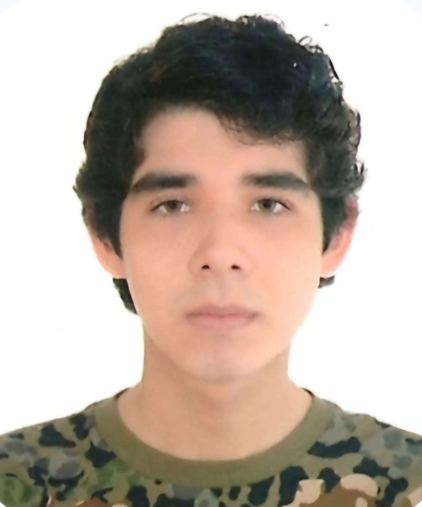
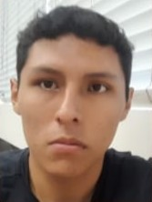
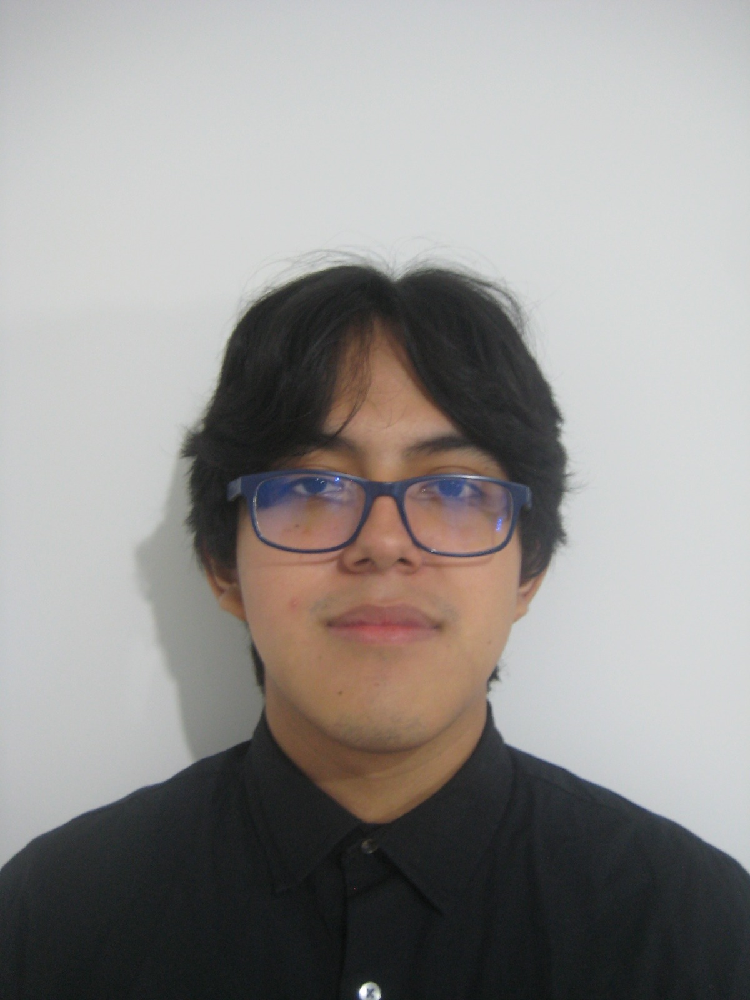
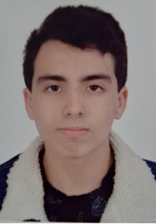

# Chapter I: Introduction

## 1.1. Startup Profile

### 1.1.1 Descripción de la Startup

SIRAN es una startup dedicada a mejorar la calidad de vida de los recién nacidos y sus familias mediante soluciones tecnológicas innovadoras, accesibles y centradas en la salud. Actualmente, tras identificar los desafíos críticos en el monitoreo y cuidado de bebés recién nacidos, hemos desarrollado SIRAN: una solución web que conecta a padres y profesionales de la salud con información confiable y en tiempo real.

A través del registro y análisis de datos del bebé, la plataforma permite a los especialistas realizar un seguimiento continuo, detectar posibles riesgos y brindar recomendaciones personalizadas. Asimismo, los padres podrán visualizar el progreso y estado de salud de sus hijos de forma clara y sencilla, fortaleciendo la prevención y el cuidado oportuno.

**Misión:**

Desarrollar tecnología innovadora y accesible que contribuya al bienestar de los recién nacidos, facilitando el monitoreo de su salud y fortaleciendo la conexión entre padres y profesionales médicos, con el fin de mejorar la calidad de vida desde las primeras etapas de desarrollo.

**Visión:**

Ser una plataforma líder en el ámbito de la salud neonatal digital, reconocida por ofrecer soluciones tecnológicas eficientes, confiables y humanas, que impacten positivamente en el cuidado infantil a nivel nacional e internacional.

### 1.1.2 Perfiles de integrantes del equipo

| Foto | Apellidos y Nombres | Código | Carrera | Acerca de |
|------|---------------------|--------|---------|-----------|
|  | Said Conde, Yazid  | U202312348  | Ingeniería de Software | Me considero una persona responsable al momento de trabajar en equipo, siempre proactivo y dispuesto a tomar las riendas en situaciones criticas. Me encanta programar y todo el area de desarrollo de software, desarrollo de videojuegos y ciberseguridad en el area de Red Team. Tengo conocimientos en Python, SQL, C++, desarrollo web. Mis conocimientos seran de gran ayuda en el desarrollo del proyecto. |
|  | Montoya Torres, Alexander Gabriel | u20231b424 | Ingeniería de Software | Soy estudiante de la carrera de Ingenieria de Sofware en la UPC, tengo 20 años actualmente, con respecto a mi carrera he logrado aprender a manejar lenguajes de programación como C++, MySQL, Python, HTML y CSS. Con respecto a lo personal, me gusta dedicar tiempo y esfuerzo a todo lo que hago ya sean actividades academicas o los hobbies que más me apasionan. Mi objetivo principal es seguir mejorando y despertando habilidades que me ayuden de manera profesonal y personal. |
|  | Flores Rios, Juan Diego | u202412124 | Ingeniería de Software | Estudiante del quinto ciclo de Ingeniería de Software en UPC y destaco por mis habilidades de liderazgo y coordinación de equipos. Posee conocimientos en C++, HTML, CSS, JavaScript y desarrollo web. |
|  | Montoya Torres, Alexander Gabriel  | u20231b424 | Ingeniería de Software|Soy estudiante de la carrera de Ingenieria de Sofware en la UPC, tengo 20 años actualmente, con respecto a mi carrera he logrado aprender a manejar lenguajes de programación como C++, MySQL, Python, HTML y CSS. Con respecto a lo personal, me gusta dedicar tiempo y esfuerzo a todo lo que hago ya sean actividades academicas o los hobbies que más me apasionan. Mi objetivo principal es seguir mejorando y despertando habilidades que me ayuden de manera profesonal y personal. |
|  |  Mauricio Jared Padilla Merino | u201911393 | Ingeniería de Software | Mi nombre es Mauricio Jared Padilla Merino (u201911393). Me encuentro cursando el quinto ciclo de la carrera de Ingenieria de Software. Me considero una persona con buena capacidad de planeación y estructuración de proyectos de esta escala, siempre manteniendo una buena comunicación con mis compañeros para escuchar críticas o feedback constructivo sobre el proyecto. De esta manera me aseguro que todos podamos contribuir con nuestro fuerte y dar el mejor esfuerzo para el proyecto |