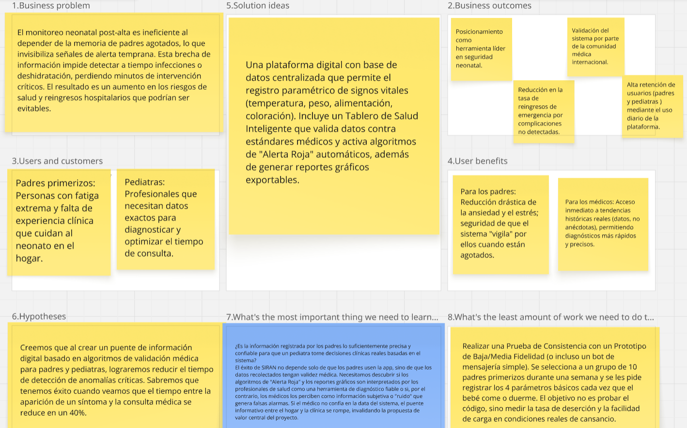

### 1.2.2 Lean UX Process

#### 1.2.2.1. Lean UX Problem Statements

El monitoreo neonatal durante la hospitalización de recién nacidos permite el seguimiento de su estado de salud por parte del personal médico, mientras que los padres dependen de la información que se les comunica para comprender la evolución del bebé.

Hemos observado un factor crítico que afecta la experiencia durante este proceso: el acceso limitado a información clara, continua y oportuna sobre el estado del recién nacido. Actualmente, tanto los padres como los profesionales médicos no siempre cuentan con una visión integral y fácilmente accesible del estado del bebé en todo momento.

¿Cómo mejorar la eficacia del monitoreo neonatal logrando que los padres registren información de manera constante y precisa, y que el personal de salud reciba datos confiables en tiempo real, para detectar señales de alerta temprana y actuar oportunamente, garantizando así la seguridad y bienestar del recién nacido y la satisfacción con el servicio?

#### 1.2.2.2. Lean UX Assumptions

User Assumption 

| # | Suposición |
|---|------------|
| 1 |  Los usuarios principales son pediatras, neonatólogos y personal de salud que monitorean recién nacidos, así como padres o cuidadores (especialmente primerizos) que necesitan apoyo para seguir la salud del bebé en casa.  |
| 2 |  Los usuarios tienen dificultad para identificar señales de alerta debido al cansancio, falta de experiencia y miedo a equivocarse.  |
| 3 |  Los usuarios necesitan funcionalidades como monitoreo sencillo (alimentación, sueño, temperatura, llanto), alertas inteligentes, registro guiado, interfaz simple y recomendaciones claras.  |
| 4 |  El producto encaja en la rutina diaria del monitoreo del recién nacido, tanto en entornos clínicos como en el hogar.  |
| 5 |  El producto será usado de forma continua en momentos clave como después de la alimentación, durante el descanso o ante cambios en el comportamiento del bebé, mediante un dashboard simple.  |
| 6 |  Los usuarios prefieren un sistema visualmente tranquilo, simple, confiable y que no genere estrés adicional.  |
| 7 |  Los usuarios necesitan una forma confiable y sencilla de monitorear la salud del bebé sin depender solo de su intuición o memoria.  |
| 8 |  Los usuarios valoran beneficios adicionales como tranquilidad, reducción de ansiedad, mejor comunicación con médicos e historial claro del bebé.  |
| 9 |  El valor principal que buscan es seguridad y tranquilidad al saber que su bebé está bien.  |
| 10 |  Estas necesidades pueden resolverse con una app intuitiva que combine registro de datos, análisis inteligente y alertas claras.  |
---

Business Assumptions

| # | Suposición |
|---|------------|
| 1 | Los centros de salud y el personal médico estarán dispuestos a adoptar esta tecnología dentro de sus procesos de monitoreo neonatal.|
| 2 |  Si los profesionales de salud no adoptan el sistema, el proyecto perderá gran parte de su valor.  |
| 3 |  La solución será un sistema inteligente que registre datos del bebé y genere alertas tempranas basadas en patrones y cambios relevantes.  |
| 4 |  Existe el riesgo de que los usuarios perciban el sistema como complicado o innecesario y dejen de usarlo.  |
| 5 |  La competencia incluye apps de seguimiento de bebés, consultas pediátricas tradicionales e información informal como internet o recomendaciones familiares.  |
| 6 |  La ventaja competitiva será el enfoque en prevención y alertas inteligentes, no solo en el registro de datos.  |
| 7 |  El modelo de negocio se basará en suscripciones premium, servicios adicionales y alianzas con clínicas.  |
| 8 |  Los clientes serán adquiridos mediante redes sociales, recomendaciones médicas y marketing digital.  |
| 9 |  Los clientes iniciales serán centros de salud con áreas neonatales, su personal médico y padres primerizos.  |

#### 1.2.2.3. Lean UX Hypothesis Statements

### **Hipótesis 1 – Registro de datos**

Creemos que si los padres pueden registrar fácilmente información diaria del bebé (alimentación, sueño, temperatura, etc.),  
entonces podrán identificar mejor cambios o comportamientos inusuales,  
sabremos que esto es cierto cuando al menos el 70% de los usuarios registre datos de forma constante durante la primera semana.

---

### **Hipótesis 2 – Alertas tempranas**

Creemos que si el sistema genera alertas automáticas ante posibles señales de riesgo,  
entonces los padres reaccionarán más rápido ante situaciones importantes,  
sabremos que esto es cierto cuando los usuarios respondan o revisen las alertas en menos de 5 minutos en la mayoría de los casos.

---

### **Hipótesis 3 – Reducción de ansiedad**

Creemos que si los padres reciben orientación clara y acompañamiento mediante la app,  
entonces se sentirán más seguros y menos ansiosos en el cuidado del recién nacido,  
sabremos que esto es cierto cuando al menos el 60% de los usuarios reporten una mejora en su tranquilidad o confianza.

---

### **Hipótesis 4 – Facilidad de uso**

Creemos que si la aplicación tiene una interfaz simple e intuitiva,  
entonces los usuarios la utilizarán de forma continua,  
sabremos que esto es cierto cuando más del 75% de los usuarios activos regresen a usar la app diariamente.

---

### **Hipótesis 5 – Valor para profesionales de salud**

Creemos que si los datos registrados pueden compartirse con profesionales de salud,  
entonces estos podrán tomar decisiones más informadas,  
sabremos que esto es cierto cuando profesionales indiquen que la información les resulta útil en al menos el 50% de los casos.

---

### **Hipótesis 6 – Modelo de negocio**

Creemos que si ofrecemos funciones avanzadas (como análisis inteligente o seguimiento detallado),  
entonces algunos usuarios estarán dispuestos a pagar por estas características,  
sabremos que esto es cierto cuando al menos el 20% de los usuarios activos considere o adquiera una versión premium.

#### 1.2.2.4. Lean UX Canvas

