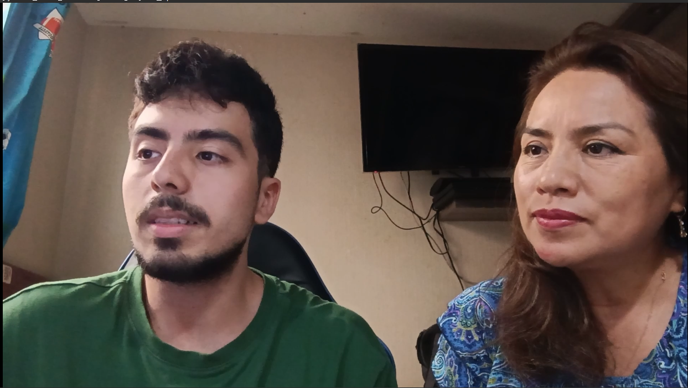
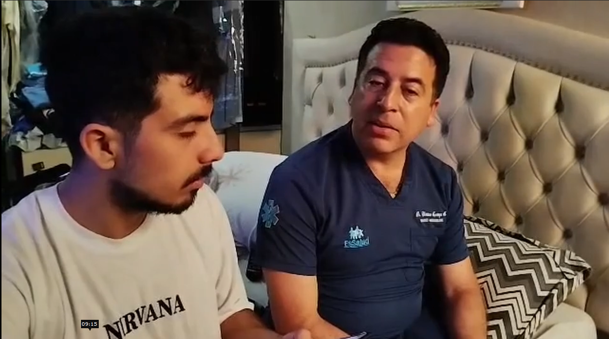
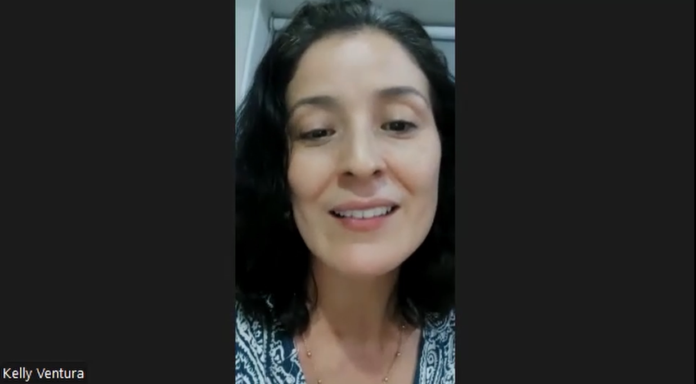
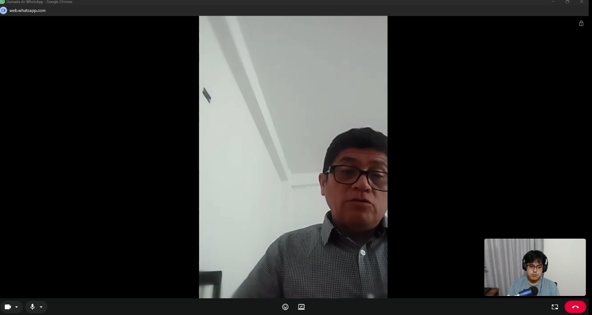
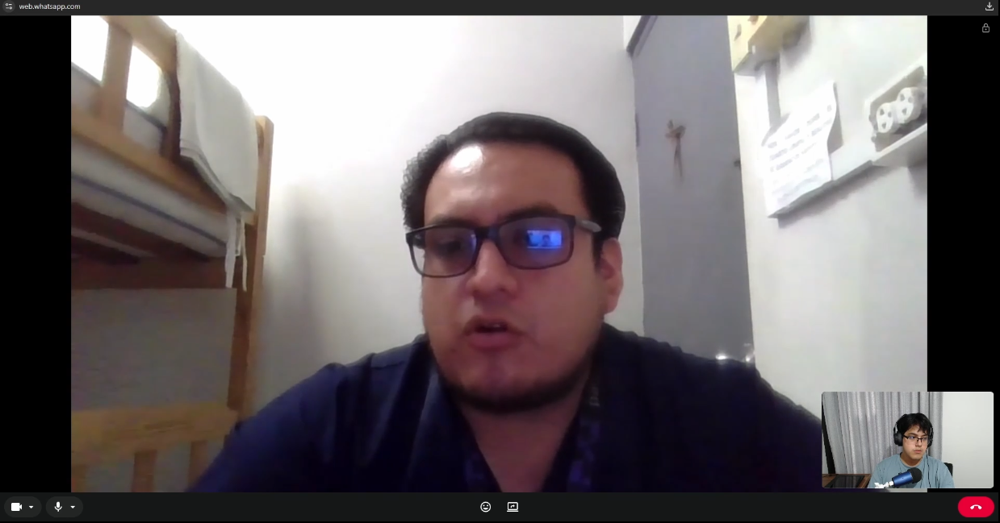

## 2.2. Entrevistas

### 2.2.1. Diseño de entrevistas

Con el objetivo de comprender a profundidad las necesidades, frustraciones y expectativas de cada segmento objetivo, se diseñaron guías de entrevista semiestructuradas diferenciadas. Las preguntas buscan recoger tanto información demográfica como actitudinal que sirva de base para la construcción de los arquetipos.

**Segmento 1: Padres primerizos**

_Preguntas principales:_

1. ¿Cómo describirías tu rutina de cuidado del bebé durante los primeros días en casa tras el alta hospitalaria?
2. ¿Qué signos vitales o parámetros de salud intentas monitorear actualmente? ¿Cómo lo haces?
3. ¿Has sentido alguna vez que no tenías suficiente información para saber si tu bebé estaba bien? Cuéntame esa experiencia.
4. ¿Usas alguna aplicación móvil o herramienta digital para el seguimiento de la salud de tu bebé? ¿Qué te gusta y qué no de ella?
5. ¿Cómo comunicas la situación de salud de tu bebé al pediatra en cada consulta?
6. ¿Qué tan fácil o difícil te resulta registrar datos de salud de forma manual? ¿Qué obstáculos encuentras?

_Preguntas complementarias:_

- ¿Cuántas horas duermes en promedio? ¿El cansancio afecta tu capacidad de llevar un registro ordenado?
- Si existiera una app que te avisara automáticamente ante una anomalía en la temperatura o saturación de tu bebé, ¿la usarías? ¿Qué te daría confianza en ella?
- ¿Qué dispositivos usas con mayor frecuencia (smartphone, tablet, laptop)?
- ¿Qué canales digitales utilizas habitualmente (WhatsApp, Instagram, grupos de madres/padres)?

---

**Segmento 2: Médicos pediatras / neonatólogos**

_Preguntas principales:_

1. ¿Qué información solicitas a los padres cuando atiendes a un neonato post-alta? ¿Con qué frecuencia esa información es precisa o completa?
2. ¿Has tomado alguna decisión clínica basada en datos inexactos proporcionados por los cuidadores? ¿Qué consecuencias tuvo?
3. ¿Utilizas actualmente alguna plataforma digital para el seguimiento remoto de tus pacientes neonatales? ¿Cuál es tu experiencia?
4. ¿Qué parámetros de salud consideras imprescindibles para monitorear entre una consulta y otra?
5. ¿Cómo gestionas las consultas no programadas o los mensajes de padres ansiosos fuera del horario de atención?
6. ¿Qué características debería tener una herramienta digital para que la recomendaras activamente a los padres de tus pacientes?

_Preguntas complementarias:_

- ¿Cuánto tiempo promedio dedicas a revisar el historial de un paciente al inicio de cada consulta?
- ¿Utilizas algún sistema de gestión clínica (HIS/EHR)? ¿Estarías dispuesto a integrarlo con una app de seguimiento parental?
- ¿Qué tan cómodo te sientes con las herramientas de telemedicina actuales?
- ¿Qué formato de reporte (gráfico, tabla, PDF) te resultaría más útil para revisar el historial de un bebé?

---

### 2.2.2. Registro de entrevistas

A continuación, se detalla el registro de las entrevistas realizadas a los representantes de nuestros dos segmentos objetivo.

**Segmento: Padres primerizos y jóvenes con acceso a tecnología**

**Entrevista 1**

- **Nombres y Apellidos:** Jessica Torres
- **Evidencia:** 
- **URL del Video:** [[Enlace a Microsoft Stream](https://upcedupe-my.sharepoint.com/:v:/g/personal/u20221g181_upc_edu_pe/IQCVE00_BsfETbX6w2TQChYLAeAqAlb2ExXR9IQdP1N6N5k?nav=eyJyZWZlcnJhbEluZm8iOnsicmVmZXJyYWxBcHAiOiJPbmVEcml2ZUZvckJ1c2luZXNzIiwicmVmZXJyYWxBcHBQbGF0Zm9ybSI6IldlYiIsInJlZmVycmFsTW9kZSI6InZpZXciLCJyZWZlcnJhbFZpZXciOiJNeUZpbGVzTGlua0NvcHkifX0&e=xczVT3)] (Inicio: 00:00)
- **Resumen:** Jessica destaca el gran nivel de estrés y fatiga producto de los despertares nocturnos (cada 2 a 3 horas) para la lactancia. Su método de monitoreo es empírico: revisar visualmente si el bebé respira o tocarlo para calcular su temperatura. No utiliza aplicaciones móviles porque le resultan poco prácticas, pero consume información en grupos de WhatsApp, Facebook e Instagram. Confirma que usaría una aplicación con alertas automáticas porque el registro manual le resulta exhaustivo y la privación de sueño dificulta llevar un control adecuado.

**Entrevista 2**

- **Nombres y Apellidos:** Cristian Alex Montoya Monteverde
- **Evidencia:** 
- **URL del Video:** [[Enlace a Microsoft Stream](https://upcedupe-my.sharepoint.com/:v:/g/personal/u20221g181_upc_edu_pe/IQCVE00_BsfETbX6w2TQChYLAeAqAlb2ExXR9IQdP1N6N5k?nav=eyJyZWZlcnJhbEluZm8iOnsicmVmZXJyYWxBcHAiOiJPbmVEcml2ZUZvckJ1c2luZXNzIiwicmVmZXJyYWxBcHBQbGF0Zm9ybSI6IldlYiIsInJlZmVycmFsTW9kZSI6InZpZXciLCJyZWZlcnJhbFZpZXciOiJNeUZpbGVzTGlua0NvcHkifX0&e=xczVT3)] (Inicio: 07:38)
- **Resumen:** Cristian señala que el registro manual de funciones vitales aumenta el estrés de los padres. Prefiere confiar en herramientas tecnológicas pasivas como cámaras y "walkie-talkies". Resalta que una aplicación ideal debería notificar con alarmas únicamente cuando haya una anomalía real (emergencia), evitando estresar a los padres con datos constantes. Se informa a través de TikTok, YouTube e Instagram. Usa el celular y la PC como dispositivos principales.

**Entrevista 3**

- **Nombres y Apellidos:** Kelly Helen Ventura Mori
- **Edad:** 41 años
- **Evidencia:** 
- **URL del Video:** [[Enlace a Microsoft Stream](https://upcedupe-my.sharepoint.com/:v:/g/personal/u20221g181_upc_edu_pe/IQCVE00_BsfETbX6w2TQChYLAeAqAlb2ExXR9IQdP1N6N5k?nav=eyJyZWZlcnJhbEluZm8iOnsicmVmZXJyYWxBcHAiOiJPbmVEcml2ZUZvckJ1c2luZXNzIiwicmVmZXJyYWxBcHBQbGF0Zm9ybSI6IldlYiIsInJlZmVycmFsTW9kZSI6InZpZXciLCJyZWZlcnJhbFZpZXciOiJNeUZpbGVzTGlua0NvcHkifX0&e=xczVT3)] (Inicio: 31:06)
- **Resumen:** Kelly, madre de un bebé de 1 año, menciona que su mayor preocupación es la respiración y temperatura de su hijo. Al inicio utilizó una aplicación para registrar la alimentación y cambios de pañal, pero la abandonó porque era muy tediosa y olvidaba hacer los registros. Actualmente delega esta tarea en la nana mediante registros físicos (papel), lo cual sigue siendo ineficiente. Duerme apenas 4 a 5 horas de forma fraccionada. Utiliza predominantemente el celular y WhatsApp. Validó positivamente la idea de usar una app automática que alerte sobre anomalías para su tranquilidad.

---

**Segmento: Pediatras y Especialistas Neonatales**

**Entrevista 4**

- **Nombres y Apellidos:** Fanny Oh
- **Evidencia:** 
- **URL del Video:** [[Enlace a Microsoft Stream](https://upcedupe-my.sharepoint.com/:v:/g/personal/u20221g181_upc_edu_pe/IQCVE00_BsfETbX6w2TQChYLAeAqAlb2ExXR9IQdP1N6N5k?nav=eyJyZWZlcnJhbEluZm8iOnsicmVmZXJyYWxBcHAiOiJPbmVEcml2ZUZvckJ1c2luZXNzIiwicmVmZXJyYWxBcHBQbGF0Zm9ybSI6IldlYiIsInJlZmVycmFsTW9kZSI6InZpZXciLCJyZWZlcnJhbFZpZXciOiJNeUZpbGVzTGlua0NvcHkifX0&e=xczVT3)] (Inicio: 15:06)
- **Resumen:** Fanny indica que los datos proporcionados por los padres suelen ser subjetivos o estar sesgados por la preocupación, por lo que el personal debe objetivar los datos (por ejemplo, con curvas de peso). No utiliza plataformas digitales de monitoreo formal, sino que da indicaciones verbales o escritas (dibujos) sobre signos de alarma. Considera fundamental que cualquier herramienta digital recomendada sea amigable, con lenguaje sencillo y enfocada en signos básicos (tos, coloración, respiración), evitando jerga médica compleja que pueda agobiar a los padres.

**Entrevista 5**

- **Evidencia:** 
- **URL del Video:** [[Enlace a Microsoft Stream](https://upcedupe-my.sharepoint.com/:v:/g/personal/u20221g181_upc_edu_pe/IQCVE00_BsfETbX6w2TQChYLAeAqAlb2ExXR9IQdP1N6N5k?nav=eyJyZWZlcnJhbEluZm8iOnsicmVmZXJyYWxBcHAiOiJPbmVEcml2ZUZvckJ1c2luZXNzIiwicmVmZXJyYWxBcHBQbGF0Zm9ybSI6IldlYiIsInJlZmVycmFsTW9kZSI6InZpZXciLCJyZWZlcnJhbFZpZXciOiJNeUZpbGVzTGlua0NvcHkifX0&e=xczVT3)] (Inicio: 39:07)
- **Resumen:** Este especialista (que trabaja con pacientes de UCI/prematuros) señala que la información de las madres o abuelas no siempre es precisa, por lo que corroboran visualmente y con el peso del bebé. Para gestionar seguimientos, brinda su número celular personal a los padres. Utiliza el sistema de gestión "Pacamuros" y "HIS". Recomienda que una app para padres debe tener un lenguaje extremadamente sencillo y enfocarse en pocos parámetros clave (peso, coloración de la piel, frecuencia respiratoria y succión). Considera que los reportes en PDF son ideales.

**Entrevista 6**

- **Nombres y Apellidos:** Miguel Ángel Chávez Valeriano
- **Edad:** 32 años
- **Ocupación:** Médico del Hospital JAMO II
- **Evidencia:** 
- **URL del Video:** [[Enlace a Microsoft Stream](https://upcedupe-my.sharepoint.com/:v:/g/personal/u20221g181_upc_edu_pe/IQCVE00_BsfETbX6w2TQChYLAeAqAlb2ExXR9IQdP1N6N5k?nav=eyJyZWZlcnJhbEluZm8iOnsicmVmZXJyYWxBcHAiOiJPbmVEcml2ZUZvckJ1c2luZXNzIiwicmVmZXJyYWxBcHBQbGF0Zm9ybSI6IldlYiIsInJlZmVycmFsTW9kZSI6InZpZXciLCJyZWZlcnJhbFZpZXciOiJNeUZpbGVzTGlua0NvcHkifX0&e=xczVT3)] (Inicio: 51:34)
- **Resumen:** El Dr. Chávez coincide en que el relato de los padres (anamnesis) solo da una orientación inicial y debe ser siempre corroborado con un examen físico para un diagnóstico seguro. Fuera del horario de consulta, atiende dudas urgentes a través de _WhatsApp Business_. Considera que una herramienta digital sería excelente si permite conectar rápidamente con el personal de salud ante emergencias y si puede integrarse a sistemas del MINSA (como el HIS). Prefiere revisar el historial de los pacientes a través de reportes en formato PDF.

---

### 2.2.3. Análisis de entrevistas

A partir del registro de las entrevistas, se ha realizado un análisis cuantitativo y cualitativo integral para identificar patrones de comportamiento, dolores y necesidades, los cuales sirven como pilar para la construcción de nuestros _User Personas_.

**Análisis del Segmento 1: Padres primerizos**
Basado en una muestra de 3 padres entrevistados, se identificaron las siguientes variables representativas:

- **Aspectos Objetivos (Comportamiento y Tecnología):**
    - El **100%** de los padres experimenta fatiga y privación del sueño por los despertares nocturnos, lo que afecta su energía diaria.
    - El **100%** utiliza predominantemente el **Smartphone** y redes sociales (WhatsApp, Instagram, TikTok) para buscar información, comunidades y consejos parentales.
    - El **66.6%** (2 de 3) intentó llevar un registro metódico (sea en aplicaciones generales o cuadernos), pero encontraron el proceso tedioso, manual y propenso al olvido.

- **Aspectos Subjetivos (Motivaciones y Frustraciones):**
    - El **100%** siente gran preocupación por parámetros vitales básicos, especialmente la respiración y la temperatura mientras el bebé duerme.
    - El **100%** busca reducir la carga mental: desean que la tecnología haga el trabajo de monitoreo y genere alertas **únicamente** cuando ocurra una anomalía real, evitando el estrés de estar revisando constantemente.

**Análisis del Segmento 2: Pediatras y Especialistas Neonatales**
Basado en una muestra de 3 profesionales de la salud, se obtuvieron los siguientes hallazgos:

- **Aspectos Objetivos (Clínicos y Tecnológicos):**
    - El **100%** de los especialistas afirma que la información brindada por los padres suele ser imprecisa o subjetiva, lo que los obliga a corroborarla siempre con evaluaciones físicas (como el peso).
    - El **100%** gestiona consultas de seguimiento no programadas o dudas de urgencia a través del teléfono (llamadas, WhatsApp o WhatsApp Business).
    - El **100%** coincide en que los reportes en formato **PDF** estructurado son la forma más rápida y útil de revisar el historial clínico antes de una consulta de 30 minutos.
    - El **66.6%** (2 de 3) utilizan o están dispuestos a integrar herramientas con sistemas de gestión clínica institucionales (como HIS o Pacamuros).

- **Aspectos Subjetivos (Motivaciones y Expectativas de diseño):**
    - El **100%** enfatiza como requisito indispensable que cualquier aplicación dirigida a los padres debe tener una interfaz **simple y con lenguaje no médico**, enfocada solo en variables críticas (respiración, coloración, temperatura, succión) para evitar la desinformación y el pánico innecesario.
