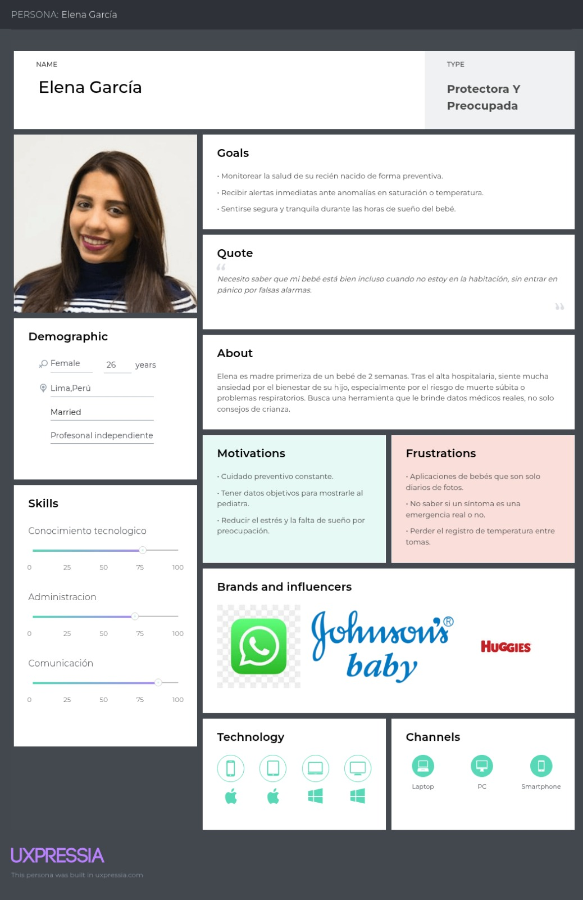
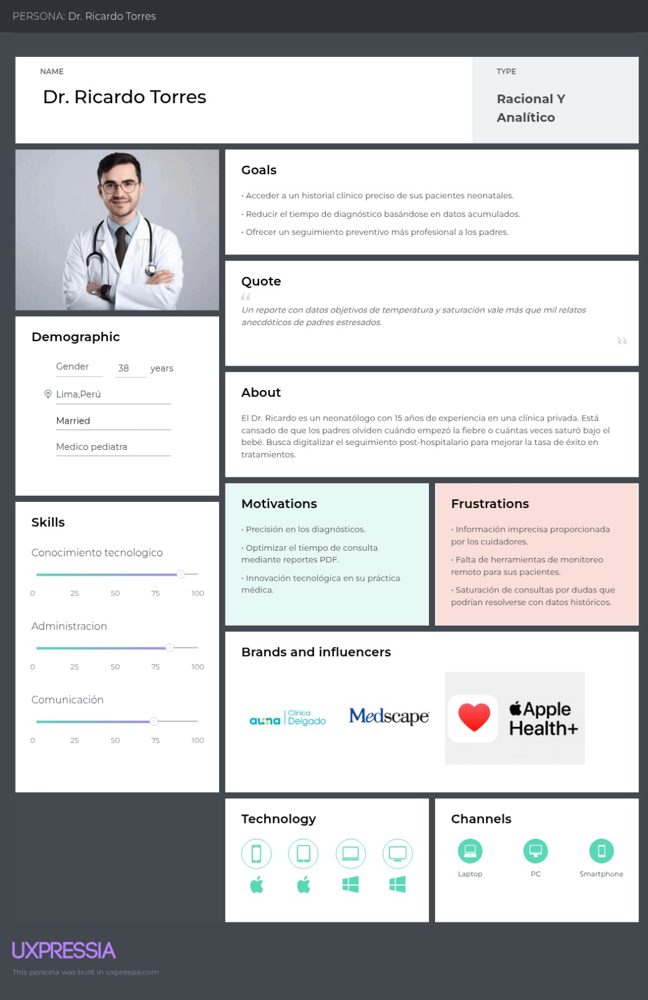
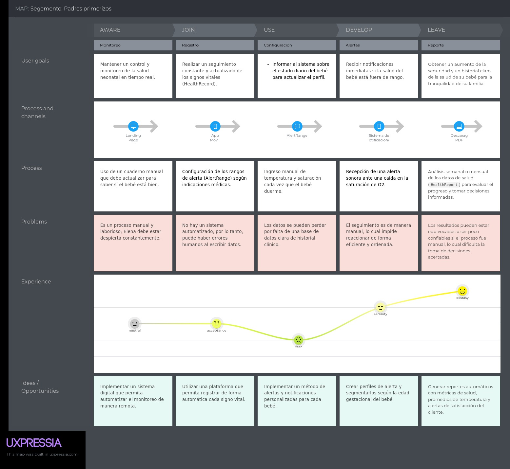
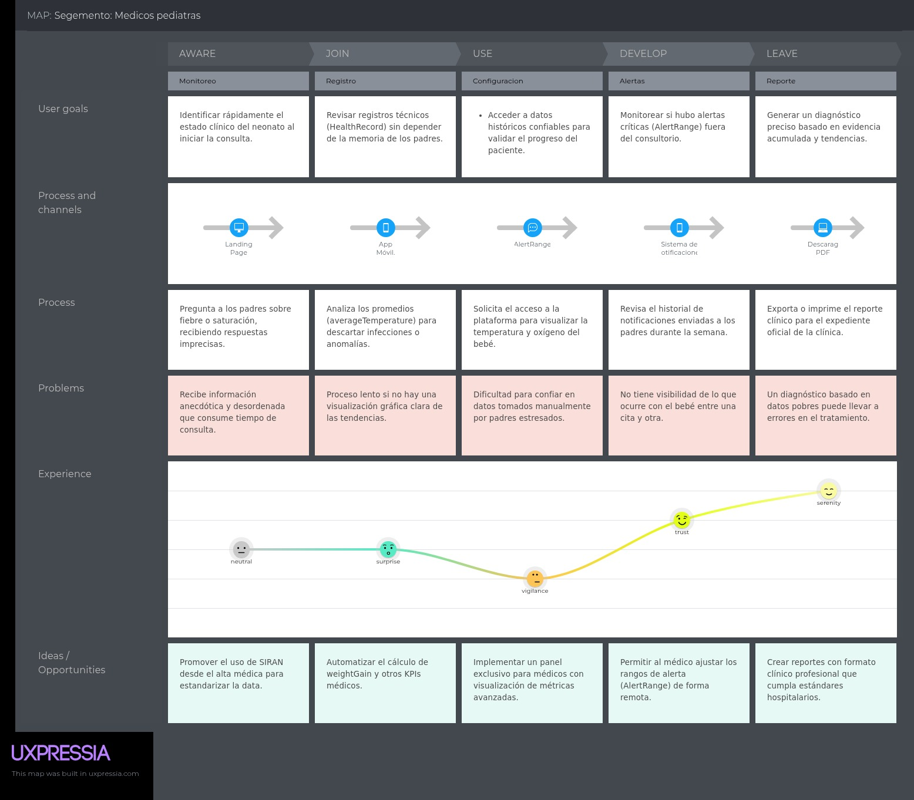
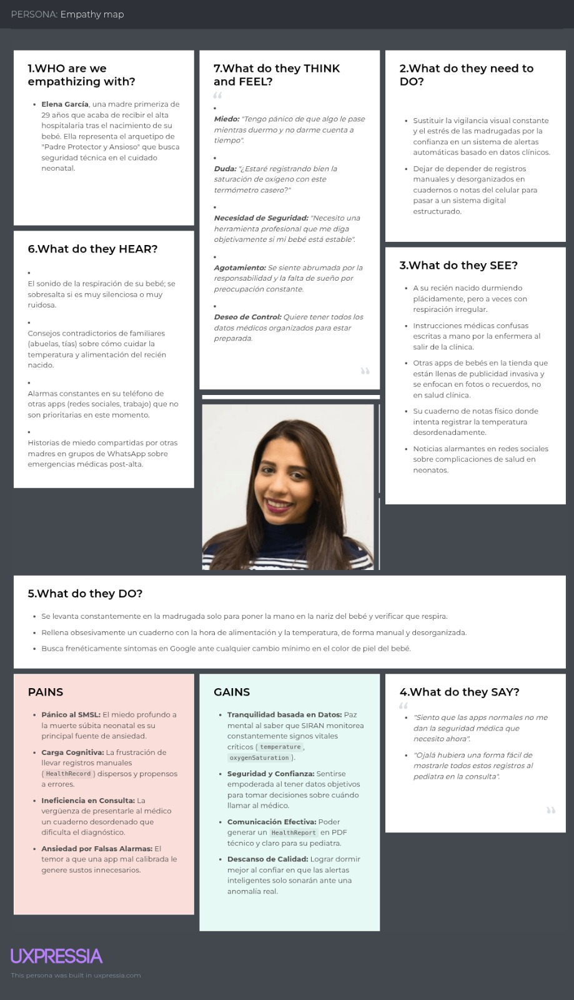
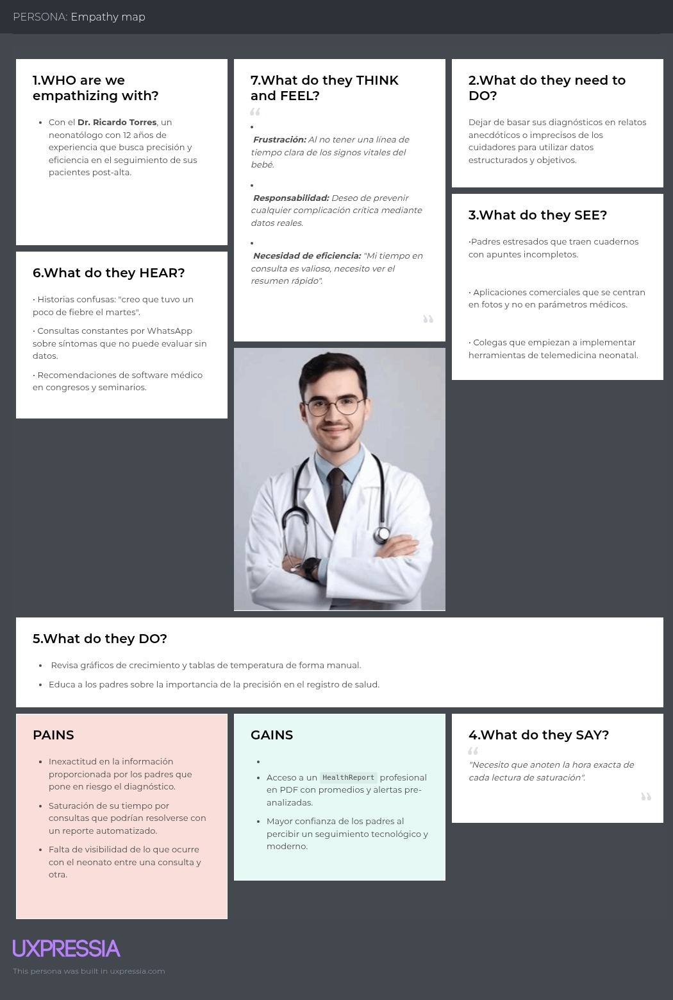

## 2.3. Needfinding

### 2.3.1. User Personas

Con base en el análisis de entrevistas y la investigación competitiva, se elaboraron dos fichas de User Persona en UXPressia, una por cada segmento objetivo. Cada arquetipo sintetiza las características demográficas, motivaciones, frustraciones y comportamientos más representativos identificados en el proceso de investigación.

---

### 2.3.2. User Task Matrix

La siguiente matriz concentra las tareas que cada User Persona realiza para cumplir sus objetivos en relación con el cuidado neonatal, independientemente de la existencia de SIRAN. Se evalúa la frecuencia e importancia de cada tarea para identificar las de mayor peso en el diseño de la solución.

| Tareas (Tasks)                              | Padres primerizos: Frecuencia | Padres primerizos: Importancia | Médicos pediatras: Frecuencia | Médicos pediatras: Importancia |
| :------------------------------------------ | :---------------------------- | :----------------------------- | :---------------------------- | :----------------------------- |
| Registrar signos vitales (O2 y Temperatura) | Alta (4-6 veces al día)       | Alta                           | N/A                           | N/A                            |
| Consultar alertas y notificaciones críticas | Alta (Según evento)           | Alta                           | Media (1 vez al día)          | Alta                           |
| Generar y exportar reportes de salud (PDF)  | Media (1 vez a la semana)     | Media                          | Alta (Durante consulta)       | Alta                           |
| Configurar rangos de alerta                 | Baja (1 vez al inicio)        | Media                          | Media (Según evolución)       | Alta                           |
| Analizar tendencias y gráficos históricos   | Media (Diario)                | Media                          | Alta (Durante consulta)       | Alta                           |

Las tareas con mayor frecuencia e importancia para el segmento de padres son el registro de signos vitales y la consulta de alertas, lo que confirma que el núcleo funcional de SIRAN debe priorizar la facilidad y rapidez de estas acciones. Para los médicos, el análisis de tendencias y la generación de reportes son las tareas de mayor valor, evidenciando la necesidad de una vista profesional diferenciada. La principal coincidencia entre ambos segmentos radica en la necesidad de alertas confiables; la principal diferencia está en la frecuencia de registro, que es exclusiva del segmento parental.

### 2.3.3. User Journey Mapping

Se elaboró un User Journey Map por cada User Persona en UXPressia, representando la situación actual (As-Is) de cada segmento sin la existencia de SIRAN. El objetivo es identificar los puntos de dolor más críticos en el flujo end-to-end del cuidado neonatal post-alta, desde el alta hospitalaria hasta la consulta de seguimiento.

**Journey Map — Elena García (Padres primerizos)**

El journey ilustra el recorrido de una madre primeriza desde que toma conciencia de la necesidad de monitorear a su bebé en casa, pasando por el registro manual de datos, la gestión de alertas propias y la preparación para la consulta médica. Los puntos de mayor tensión emocional se concentran en las madrugadas, cuando el agotamiento y la falta de criterios objetivos generan pánico e incertidumbre.

**Journey Map — Dr. Ricardo Torres (Médicos pediatras)**

El journey del médico comienza en el momento de la consulta de seguimiento, donde debe reconstruir el estado del bebé a partir de relatos imprecisos de los padres. Las etapas de mayor fricción se dan en la fase de recolección de información y en la gestión de consultas no programadas fuera del horario de atención, situaciones que consumen tiempo y reducen la calidad del diagnóstico.

### 2.3.4. Empathy Mapping

Los Empathy Maps elaborados en UXPressia profundizan en la dimensión emocional y perceptual de cada User Persona, complementando la información objetiva de los Journey Maps. Para cada arquetipo se identificaron sus pains y gains más relevantes en relación con el problema del monitoreo neonatal.

**Empathy Map — Elena García (Madre primeriza)**

Elena representa al arquetipo de "Padre Protector y Ansioso". Su principal pain es el miedo al Síndrome de Muerte Súbita del Lactante (SMSL) y la carga cognitiva de llevar registros manuales desorganizados. Su gain central es la tranquilidad basada en datos: poder confiar en un sistema que vigile al bebé cuando ella está agotada y generar un reporte claro para su pediatra.

**Empathy Map — Dr. Ricardo Torres (Neonatólogo)**

El Dr. Torres experimenta frustración ante la invisibilidad del estado del bebé entre consultas y la saturación de su tiempo por mensajes de WhatsApp que no aportan datos objetivos. Su gain principal es el acceso a un HealthReport profesional con promedios y alertas pre-analizadas, que le permita tomar decisiones clínicas en menos de dos minutos de revisión.

