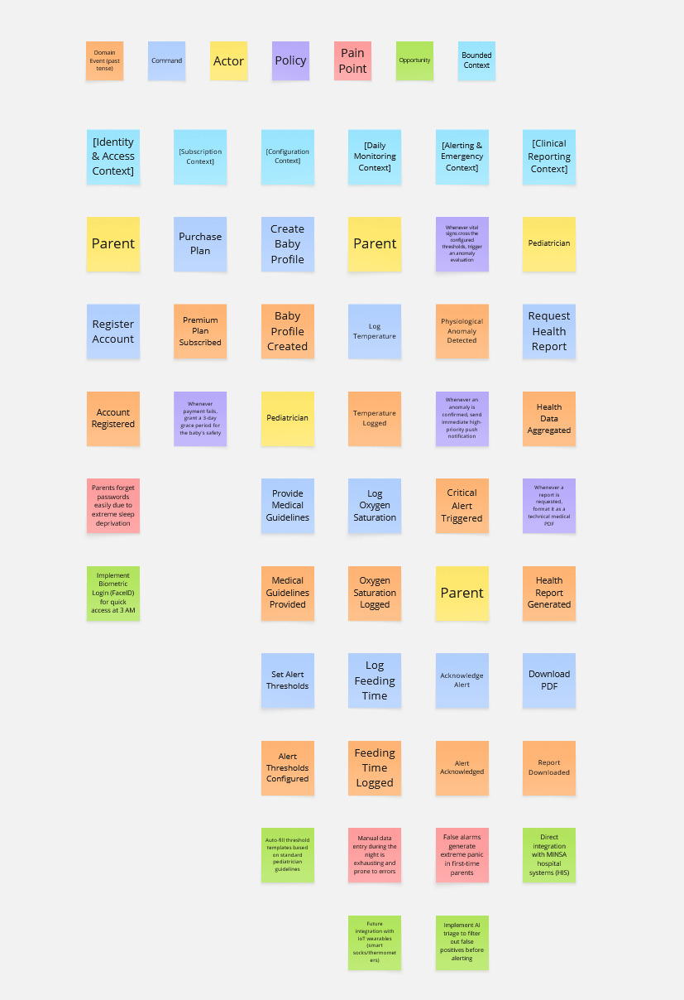

### 2.4. Big Picture Event Storming

Para comprender el dominio del negocio de SIRAN en su totalidad, el equipo realizó una sesión colaborativa de Big Picture Event Storming utilizando la herramienta Miro. El objetivo de esta sesión fue identificar los eventos de negocio más significativos, las relaciones entre ellos y los principales puntos de dolor y oportunidad en el flujo completo del sistema, desde el alta hospitalaria del neonato hasta la generación de reportes clínicos para el médico.

_Nota: La imagen muestra el tablero completo de la sesión de Big Picture Event Storming realizada en Miro. Las notas naranjas representan Domain Events, las rojas señalan Pain Points identificados por el equipo, y las líneas de agrupación delimitan los Bounded Contexts candidatos._
