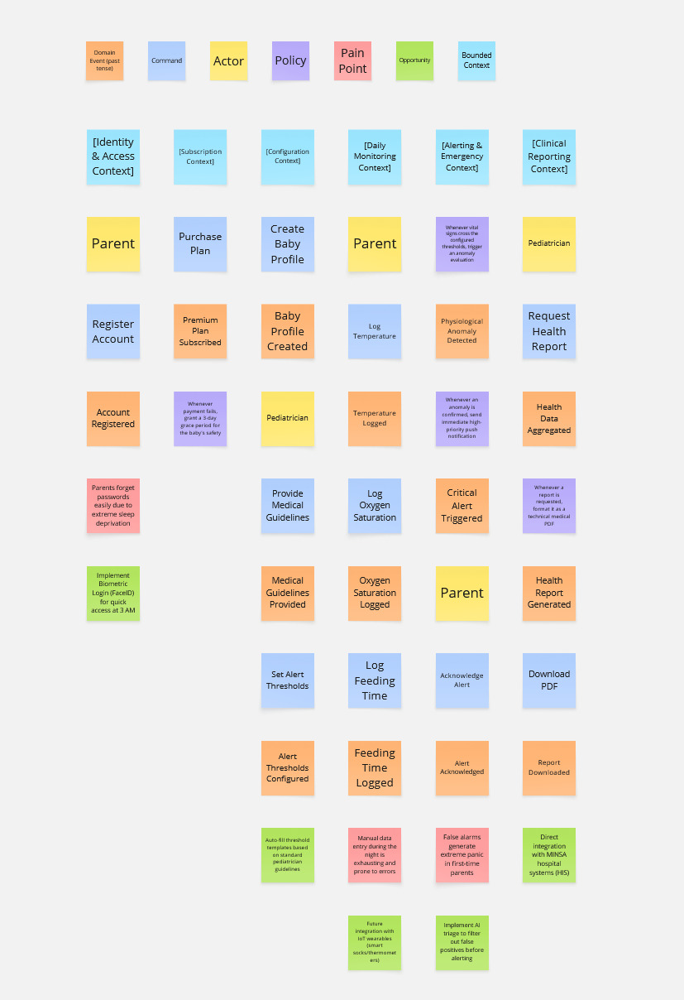
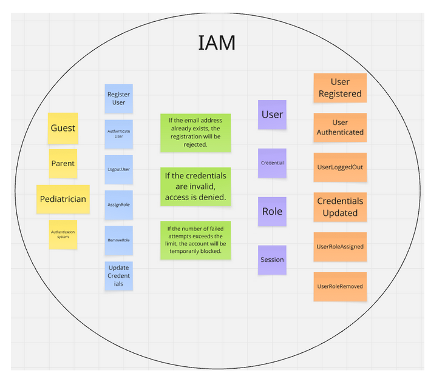
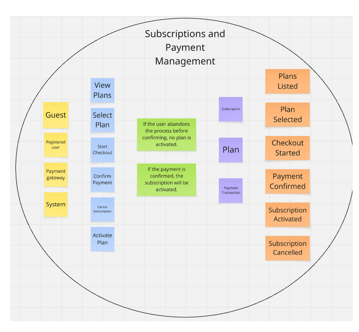
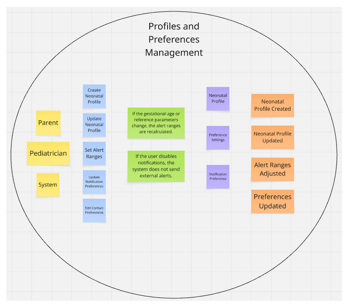
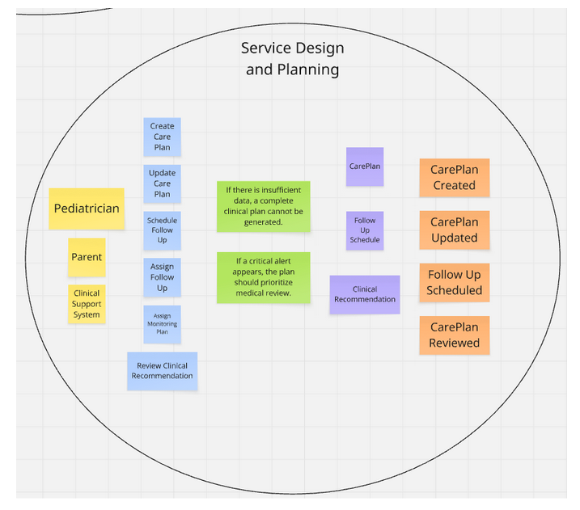
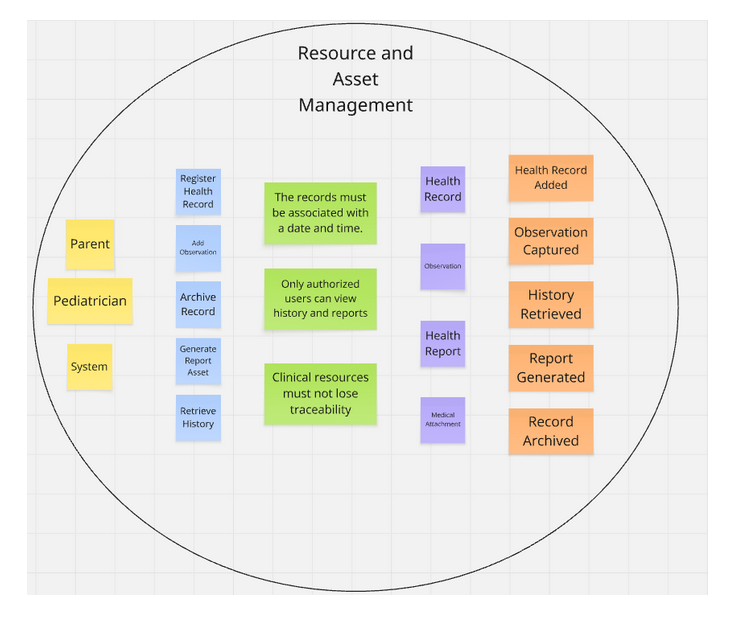
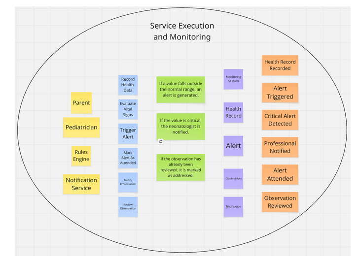
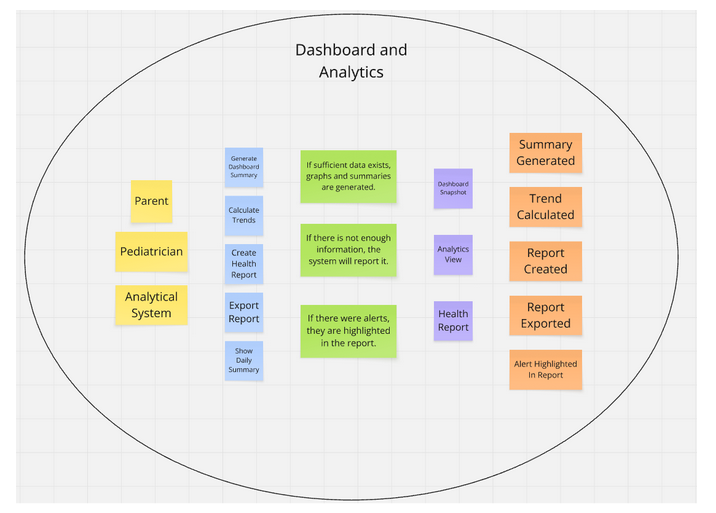

### 2.4. Big Picture Event Storming

Para comprender el dominio del negocio de SIRAN en su totalidad, el equipo realizó una sesión colaborativa de Big Picture Event Storming utilizando la herramienta Miro. El objetivo de esta sesión fue identificar los eventos de negocio más significativos, las relaciones entre ellos y los principales puntos de dolor y oportunidad en el flujo completo del sistema, desde el alta hospitalaria del neonato hasta la generación de reportes clínicos para el médico.

_Nota: La imagen muestra el tablero completo de la sesión de Big Picture Event Storming realizada en Miro. Las notas naranjas representan Domain Events, las rojas señalan Pain Points identificados por el equipo, y las líneas de agrupación delimitan los Bounded Contexts candidatos._

La sesión de Big picture event storming se realizó con el objetivo de refinar el modelo del dominio y detallar sus elementos clave, identificando actores, comandos, eventos, políticas y agregados. A través de un trabajo colaborativo en Miro, se organizaron los flujos principales del sistema y se definieron los Bounded Contexts, estableciendo una base clara para el diseño de la arquitectura.

El desarrollo del proceso se puede visualizar en el siguiente enlace: [ [Design-Level Event Storming]](https://miro.com/welcomeonboard/UFhITU8rUkxVZFhnblJRUy9PdmFPeDdzOTIvZExBTEM5TmJPeVYxZUF5RWhRTDI4UlowVGMvMFllVnhESHBxYU13RzMvTVJjWURqeXFRYkgvSkFFYWw1TEV4U05HWGsxNE80cnhWNDRwVTM4Z3U3VzM1dHFsRitYVFRiK3Jra3p3VHhHVHd5UWtSM1BidUtUYmxycDRnPT0hdjE=?share_link_id=797126758654)

#### 1. Bounded Context IAM

El bounded context Identity and Access Management se encarga de gestionar la identidad digital de los usuarios y controlar el acceso seguro a la plataforma. Su responsabilidad principal es garantizar que únicamente usuarios autenticados y autorizados puedan interactuar con las funcionalidades del sistema. Este contexto administra procesos como el registro de usuarios, autenticación, gestión de credenciales y control de roles. Además, establece las reglas de seguridad necesarias para proteger la información sensible, asegurando la confidencialidad e integridad de los datos dentro del ecosistema.

#### 2. Bounded Context Subscriptions and Payment Management

El bounded context Subscriptions and Payment Management gestiona todo lo relacionado con los modelos de suscripción y los procesos de pago dentro de la plataforma. Su objetivo es permitir que los usuarios accedan a diferentes niveles de servicio según el plan seleccionado. Este contexto administra la visualización de planes, la activación de suscripciones, la validación de transacciones y la gestión del estado de los pagos. Asimismo, garantiza que el acceso a funcionalidades avanzadas esté condicionado al estado de la suscripción del usuario.

#### 3. Bounded Context Profiles and Preferences Management

El bounded context Profiles and Preferences Management se encarga de la gestión de la información del usuario y de la configuración personalizada del sistema. Su propósito es adaptar el comportamiento de la plataforma a las características específicas de cada usuario y del neonato. Incluye la administración de perfiles, parámetros clínicos configurables y preferencias de notificación. Este contexto permite ajustar el sistema a diferentes escenarios, asegurando que las alertas y recomendaciones sean coherentes con las condiciones particulares de cada caso.

#### 4. Bounded Context Service Design and Planning

El bounded context Service Design and Planning se enfoca en la planificación del seguimiento clínico y la estructuración de las acciones que guían el monitoreo del neonato. Su objetivo es organizar de manera lógica y anticipada las actividades necesarias para el cuidado continuo. Este contexto permite definir esquemas de seguimiento, establecer prioridades de atención y estructurar recomendaciones basadas en el estado del neonato. Actúa como un componente estratégico que orienta la toma de decisiones y coordina las acciones dentro del sistema.

#### 5. Bounded Context Resource and Asset Management

El bounded context Resource and Asset Management gestiona los recursos de información generados dentro de la plataforma, especialmente los datos clínicos y registros asociados al neonato. Su finalidad es garantizar la correcta organización, almacenamiento y disponibilidad de la información. Incluye la administración de registros de salud, observaciones y documentos clínicos. Este contexto asegura la trazabilidad de los datos a lo largo del tiempo, permitiendo su consulta, análisis y reutilización en diferentes procesos del sistema.

#### 6. Bounded Context Service Execution and Monitoring

El bounded context Service Execution and Monitoring constituye el núcleo operativo del sistema, donde se ejecuta el monitoreo continuo del estado del neonato. Su responsabilidad es procesar los datos registrados, evaluar su validez y detectar posibles anomalías. Este contexto se encarga de la validación de parámetros, la generación de alertas y la gestión de eventos críticos. Además, coordina la comunicación de resultados hacia otros contextos, permitiendo una respuesta oportuna ante situaciones de riesgo.

#### 7. Bounded Context Dashboard and Analytics

El bounded context Dashboard and Analytics se encarga de transformar los datos registrados en información significativa para los usuarios. Su objetivo es facilitar la interpretación del estado del neonato mediante visualizaciones claras y análisis comprensibles. Incluye la generación de reportes, resúmenes y representaciones gráficas de la evolución del bebé. Este contexto permite identificar patrones, tendencias y comportamientos relevantes que apoyan la toma de decisiones tanto de padres como de profesionales de la salud.

