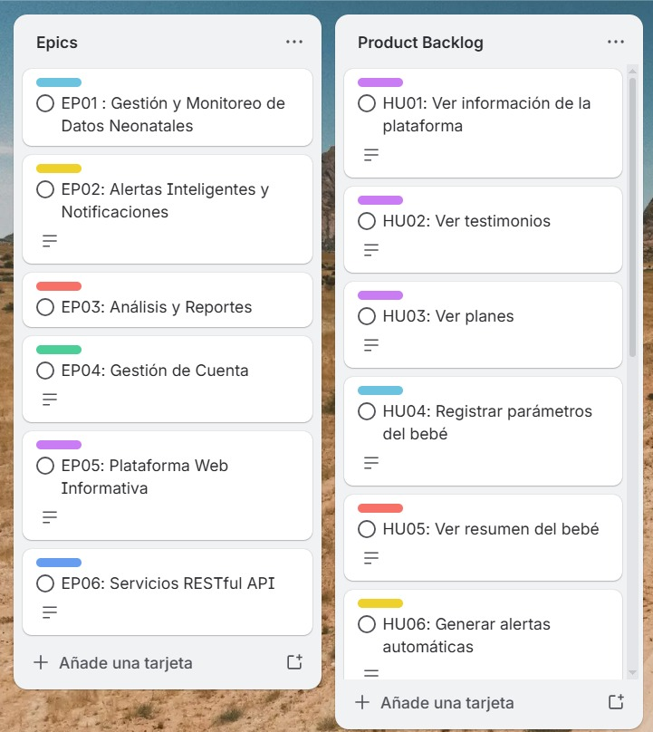

## 3.3. Product Backlog
El siguiente Product Backlog presenta la priorización de las User Stories del sistema SIRAN, organizadas en función del valor que aportan al negocio. Se incluyen las historias relacionadas con la Plataforma Web Informativa (Landing Page) para validar la propuesta de valor del producto y atraer usuarios desde etapas tempranas. Seguidamente se priorizan las funcionalidades clave del sistema relacionadas con el monitoreo del bebé, generación de alertas y análisis de datos. Finalmente, se consideran las historias asociadas a la gestión de cuentas, dado que no representan el mayor valor inicial para el usuario. 

| #Orden | User Story ID | Título                           | Descripción                                                                           | Story Points (1 / 2 / 3 / 5 / 8) |
| ------ | ------------- | -------------------------------- | ------------------------------------------------------------------------------------- | -------------------------------- |
| 1      | HU01          | Ver información de la plataforma | Como visitante, quiero conocer beneficios para decidir uso.                           | 2                                |
| 2      | HU02          | Ver testimonios                  | Como visitante, quiero ver testimonios para generar confianza.                        | 2                                |
| 3      | HU03          | Ver planes                       | Como visitante, quiero ver planes para evaluar opciones.                              | 2                                |
| 4      | HU04          | Registrar parámetros del bebé    | Como padre, quiero registrar parámetros del bebé para llevar control de su evolución. | 5                                |
| 5      | HU05          | Ver resumen del bebé             | Como padre, quiero ver resumen para evaluación rápida.                                | 3                                |
| 6      | HU06          | Generar alertas automáticas      | Como padre, quiero recibir alertas para reaccionar ante riesgos.                      | 8                                |
| 7      | HU07          | Recibir notificaciones           | Como padre, quiero recibir notificaciones externas ante alertas.                      | 3                                |
| 8      | HU08          | Consultar historial del bebé     | Como neonatólogo, quiero consultar historial para evaluar evolución.                  | 5                                |
| 9      | HU09          | Visualizar reportes              | Como padre, quiero ver reportes para entender evolución.                              | 5                                |
| 10     | HU10          | Generar reportes médicos         | Como neonatólogo, quiero generar reportes clínicos para consultas.                    | 5                                |
| 11     | HU11          | Registrar observaciones          | Como padre, quiero registrar observaciones para complementar datos.                   | 3                                |
| 12     | HU12          | Revisar observaciones            | Como neonatólogo, quiero revisar observaciones para seguimiento.                      | 3                                |
| 13     | HU13          | Alertas para profesionales       | Como neonatólogo, quiero recibir alertas para priorizar atención.                     | 8                                |
| 14     | HU14          | Registro de usuario              | Como usuario, quiero registrarme para acceder al sistema.                             | 3                                |
| 15     | HU15          | Inicio de sesión                 | Como usuario, quiero iniciar sesión para acceder.                                     | 2                                |
| 16     | HU16          | Cerrar sesión                    | Como usuario, quiero cerrar sesión para proteger cuenta.                              | 1                                |

Link de Trello: 
[https://trello.com/invite/b/69ea2e9d8dcbf9a288252eda/ATTI72d9bb3d41ddaf2e8dc030956dac273f59A009D8/apps-web-product-backlog](https://trello.com/invite/b/69ea2e9d8dcbf9a288252eda/ATTI72d9bb3d41ddaf2e8dc030956dac273f59A009D8/apps-web-product-backlog)
