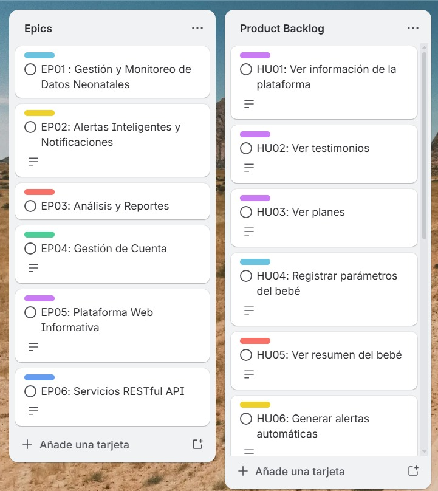

## 3.3. Product Backlog
El siguiente Product Backlog presenta la priorización de las User Stories del sistema SIRAN, organizadas en función del valor que aportan al negocio. Se incluyen las historias relacionadas con la Plataforma Web Informativa (Landing Page) para validar la propuesta de valor del producto y atraer usuarios desde etapas tempranas. Seguidamente se priorizan las funcionalidades clave del sistema relacionadas con el monitoreo del bebé, generación de alertas y análisis de datos. Finalmente, se consideran las historias asociadas a la gestión de cuentas, dado que no representan el mayor valor inicial para el usuario. 

| #Orden | User Story ID | Título                                     | Descripción                                                                                                           | Story Points (1 / 2 / 3 / 5) |
| ------ | ------------- | ------------------------------------------ | --------------------------------------------------------------------------------------------------------------------- | ---------------------------- |
| 1      | HU01          | Ver información de la plataforma           | Como visitante, quiero conocer beneficios para decidir uso.                                                           | 2                            |
| 2      | HU04          | Visualizar misión y visión institucional   | Como visitante, quiero conocer la misión y visión de SIRAN para comprender el propósito de la plataforma.             | 1                            |
| 3      | HU05          | Navegar entre secciones de la Landing Page | Como visitante, quiero navegar fácilmente entre las secciones para encontrar información rápidamente.                 | 3                            |
| 4      | HU06          | Visualizar contenido responsive            | Como visitante, quiero acceder desde diferentes dispositivos para visualizar correctamente la plataforma.             | 3                            |
| 5      | HU07          | Visualizar beneficios del sistema          | Como visitante, quiero conocer las funcionalidades principales para comprender el valor de la plataforma.             | 2                            |
| 6      | HU02          | Ver testimonios                            | Como visitante, quiero ver testimonios para generar confianza.                                                        | 2                            |
| 7      | HU03          | Ver planes                                 | Como visitante, quiero ver planes para evaluar opciones.                                                              | 2                            |
| 8      | HU08          | Acceder a información de contacto          | Como visitante, quiero acceder a información de contacto para comunicarme con el equipo de SIRAN.                     | 1                            |
| 9      | HU09          | Visualizar preguntas frecuentes            | Como visitante, quiero consultar preguntas frecuentes para resolver dudas rápidamente.                                | 2                            |
| 10     | HU10          | Acceder a llamadas a la acción             | Como visitante, quiero visualizar botones de acción para acceder rápidamente a la plataforma.                         | 1                            |
| 11     | HU11          | Registrar parámetros del bebé              | Como padre, quiero registrar parámetros del bebé para llevar control de su evolución.                                 | 5                            |
| 12     | HU12          | Ver resumen del bebé                       | Como padre, quiero ver un resumen para realizar una evaluación rápida.                                                | 3                            |
| 13     | HU13          | Generar alertas automáticas                | Como padre, quiero recibir alertas para reaccionar ante riesgos.                                                      | 5                            |
| 14     | HU14          | Recibir notificaciones                     | Como padre, quiero recibir notificaciones externas ante alertas críticas.                                             | 3                            |
| 15     | HU18          | Registrar observaciones                    | Como padre, quiero registrar observaciones para complementar la información clínica.                                  | 2                            |
| 16     | HU15          | Consultar historial del bebé               | Como neonatólogo, quiero consultar el historial para evaluar la evolución clínica.                                    | 5                            |
| 17     | HU19          | Revisar observaciones                      | Como neonatólogo, quiero revisar observaciones para mejorar el seguimiento clínico.                                   | 2                            |
| 18     | HU20          | Alertas para profesionales                 | Como neonatólogo, quiero recibir alertas para priorizar la atención médica.                                           | 5                            |
| 19     | HU16          | Visualizar reportes                        | Como padre, quiero visualizar reportes para comprender la evolución del bebé.                                         | 5                            |
| 20     | HU17          | Generar reportes médicos                   | Como neonatólogo, quiero generar reportes clínicos para consultas médicas.                                            | 5                            |
| 21     | HU21          | Registro de usuario                        | Como usuario, quiero registrarme para acceder al sistema.                                                             | 3                            |
| 22     | HU22          | Inicio de sesión                           | Como usuario, quiero iniciar sesión para acceder a la plataforma.                                                     | 2                            |
| 23     | HU23          | Cerrar sesión                              | Como usuario, quiero cerrar sesión para proteger mi cuenta.                                                           | 1                            |
| 24     | TS01          | Análisis de necesidades                    | Como developer, quiero documentar el problema y las necesidades para guiar el desarrollo.                             | 2                            |
| 25     | TS02          | Modelo de negocio                          | Como developer, quiero definir el modelo de negocio para establecer la viabilidad del proyecto.                       | 2                            |
| 26     | TS03          | Especificación de requisitos               | Como developer, quiero definir requisitos funcionales y no funcionales para estructurar el sistema.                   | 3                            |
| 27     | TS04          | Diseño de producto                         | Como developer, quiero diseñar la arquitectura del sistema para facilitar la implementación.                          | 5                            |
| 28     | TS05          | Implementación de Landing Page             | Como developer, quiero implementar la interfaz web informativa para mostrar beneficios, testimonios y planes.         | 5                            |
| 29     | TS06          | API de registro de datos del bebé          | Como developer, quiero implementar un endpoint para registrar datos del bebé para persistir información clínica.      | 5                            |
| 30     | TS07          | API de consulta de historial               | Como developer, quiero implementar un endpoint para consultar el historial del bebé para obtener información clínica. | 5                            |
| 31     | TS08          | Lógica de alertas                          | Como developer, quiero procesar datos clínicos para detectar valores fuera de rango y generar alertas.                | 5                            |
| 32     | TS09          | API de alertas                             | Como developer, quiero implementar un endpoint para consultar alertas y visualizar eventos críticos.                  | 3                            |
| 33     | TS10          | API de reportes                            | Como developer, quiero implementar un endpoint para generar reportes clínicos para análisis médico.                   | 5                            |

Link de Trello: https://trello.com/invite/b/69ea2e9d8dcbf9a288252eda/ATTI72d9bb3d41ddaf2e8dc030956dac273f59A009D8/apps-web-product-backlog
