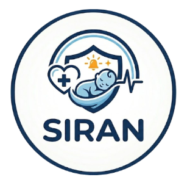
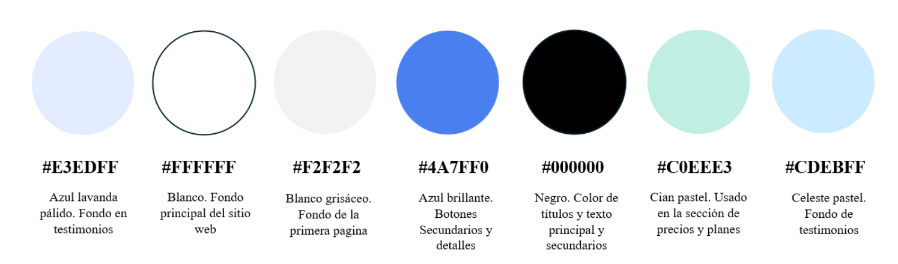

# Chapter IV: Product Design

## 4.1. Style Guidelines

### 4.1.1. General Style Guidelines

__Branding:__

Para el logotipo de SIRAN, se ha optado por un diseño protector y clínico que refleja la seguridad de la aplicación. El logotipo se compone de una tipografía sólida y moderna, acompañada de un icono que simboliza el cuidado neonatal y el monitoreo constante, así como un escudo de protección. Los colores utilizados son tonos azules y celestes, lo que refuerza la idea de confianza, salud y tranquilidad.

__Tipografía:__

La tipografía de nuestra aplicación será fácilmente legible y estética, por lo que se hará uso de la fuente Poppins para los botones y títulos. Para los textos haremos uso de Roboto, con interlineado de 1,15 con el tamaño base de 18px en la página web, además para la versión móvil el tamaño de letra será 16px.

__Pesos:__

# Heading 1 (18px, Bold, Negro)
# Heading 1 (18px, Normal, Blanco)

## Heading 2 (16px, Rojo)
## Heading 2 (16px, SkyBlue)

### Heading 3 (14px, LawnGreen)

**Text (11px, Bold, Rojo)**

Text (9px, Blanco)

__Colors:__

Nuestra plataforma, al estar dirigida a centros de salud y atención neonatal, utiliza una paleta cromática que transmite confianza, cuidado y profesionalismo: el #E3EDFF (azul lavanda pálido) aporta calma y cercanía en testimonios, el #FFFFFF (blanco) representa limpieza y orden, el #F2F2F2 (blanco grisáceo) permite diferenciar secciones con sutileza, el #4A7FF0 (azul brillante) resalta elementos interactivos y fomenta la interacción, el #000000 (negro) asegura legibilidad y formalidad en los textos, el #C0EEE3 (cian pastel) transmite bienestar y armonía, y el #CDEBFF ( pastel celeste) refuerza la serenidad y la seguridad visual en la experiencia del usuario.

__Spacing:__

El diseño de Siran destaca por un espacio amplio y regular que sirve como eje organizador. Esta apuesta por el "aire" entre elementos mejora la claridad informativa y proyecta una imagen de orden y estabilidad, haciendo que la interacción del usuario sea mucho más cómoda.

Escala de Espaciado (Spacing System)
4PX --- Micro-ajustes (iconos, etiquetas pequeñas).
8PX --- Espaciado interno entre elementos muy cercanos (título y subtítulo).
12PX --- Espaciado entre elementos de una lista o tarjetas pequeñas.
16PX --- Relleno (padding) interno estándar para botones y tarjetas.
20PX --- Espaciado entre bloques de texto cortos.
24PX --- Margen entre elementos de un mismo grupo (botones de planes).
32PX --- Espacio entre columnas o elementos secundarios.
40PX --- Margen superior/inferior para secciones pequeñas de contenido.
48PX --- Separación estándar entre secciones de información (Testimonios).
64PX --- Espaciado generoso para resaltar el Hero (cabecera).
80PX --- Margen de seguridad para respiración visual en dispositivos móviles.
96PX --- Separación amplia entre secciones principales (Precios y Beneficios).
128PX --- Margen superior/inferior para secciones de impacto visual alto.
160PX --- Espaciado máximo para secciones con mucho aire (Capturas de pantalla).
192PX --- Margen de diseño para pantallas de escritorio extra anchas.
256PX --- Espaciado de diseño para composiciones artísticas o cierres de página.

__Tono de Comunicación y Lenguaje__

Para SIRAN, las dimensiones de comunicación se sitúan en un punto de equilibrio entre la autoridad clínica y la empatía humana, adoptando las siguientes posturas:

- Serio : El manejo de datos vitales de bebés exige un rigor absoluto. La comunicación debe transmitir precisión y responsabilidad.

- Formal: Se utiliza un lenguaje profesional que respete la relación médico-paciente y la institucionalidad de la clínica.

- Respetuoso: Se reconoce la vulnerabilidad y la preocupación de los padres y el personal médico ante una alerta.

- Sereno: En lugar de una energía vibrante, se busca una calma que inspira control y seguridad en momentos de tensión.

__Sustento de Principios y Orientación del Servicio__

La página estará orientada como una extensión digital de la confianza clínica. Tomando como referencia sistemas de diseño como Carbon Health o Spectrum (Adobe), las decisiones se basan en:

__1. Claridad Operativa:__ Reducción de ruido visual. La información crítica (alertas y signos) debe ser legible en segundos, priorizando la jerarquía visual para evitar la fatiga cognitiva del personal de salud.

__2. Empatía Silenciosa:__ El uso de espacios en blanco y una paleta de azules suaves busca reducir la ansiedad del usuario, creando una interfaz que se siente como una herramienta de apoyo, no como una fuente de estrés adicional.

__3. Accesibilidad y Confiabilidad:__ El diseño se centra en la "consistencia" (un principio de Material Design), asegurando que cada icono y mensaje de lenguaje sea predecible, eliminando cualquier ambigüedad en la interpretación de los datos del bebé.

"SIRAN se presenta como un ecosistema de vigilancia silenciosa y precisa, donde la tecnología se humaniza para ofrecer paz mental a través de una comunicación directa, experta y profundamente protectora."

### 4.1.2. Web Style Guidelines

Para SIRAN, hemos diseñado una plataforma web bajo un enfoque de Diseño Adaptable (Responsive Web Design), garantizando que el monitoreo clínico y la información de salud sean accesibles y perfectamente legibles desde cualquier dispositivo, ya sea una tablet en clínica o un smartphone para los padres.

Como equipo, hemos optado por incorporar el patrón de diseño en forma de F en nuestro sitio web. Esta técnica es ideal para páginas con carga de contenido informativo y servicios clínicos, ya que emula el comportamiento natural de lectura. Ubicamos el logotipo en la esquina superior izquierda para establecer identidad inmediata, seguido de un menú de navegación horizontal que culmina en un botón de acción (CTA) destacado en la esquina superior derecha para facilitar la conversión inmediata.