## 4.3. Landing Page UI Design

El diseño de la interfaz de usuario de landing se desarrolló a partir de las decisiones definidas en la arquitectura de información, asegurando la estructura clara y centrada en el usuario.
En base a ello, se diseñó una interfaz coherente y enfocada al usuario, aplicando una paleta de colores suaves. Además, se tomó en cuenta la experiencia del usuario garantizando accesibilidad, facilidad de uso y la adaptación a distintos dispositivos móviles.

### 4.3.1. Landing Page Wireframe

#### Landing Page para Desktop Web Browser

En este apartado se describe la estructura del sitio de nuestro proyecto. Con el fin de proporcionar una visión más clara del contenido que estará disponible en la plataforma.

__Header (Encabezado):__

Ubicado en la parte superior, contiene el logotipo  y el menú de navegación (Home, Beneficios, Testimonios, Planes). Su función es permitir el acceso rápido a las secciones principales sin perder el contexto.

<!--IMAGEN DEL HEADER-->
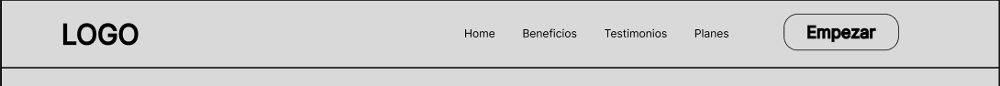

__Sección Principal:__

Es la primera sección visible. Incluye un mensaje principal , una breve descripción y un botón CTA como “Prueba Demo”. Su función es captar la atención del usuario e interactuar con la plataforma.

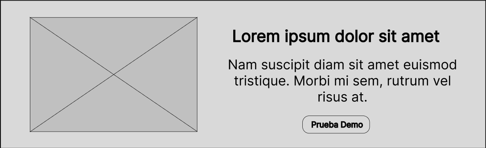

__Sección de Beneficios:__

Presenta las ventajas principales del sistema (monitoreo en tiempo real, seguridad, tecnología médica.

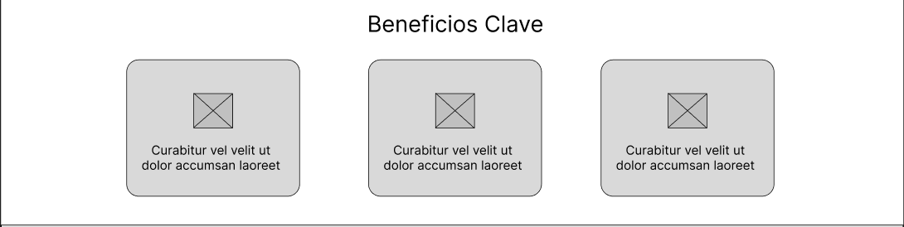

__Sección de Testimonios:__

Muestra las experiencia de usuarios como padres o pediatras. Su función es generar confianza a otros usuarios.

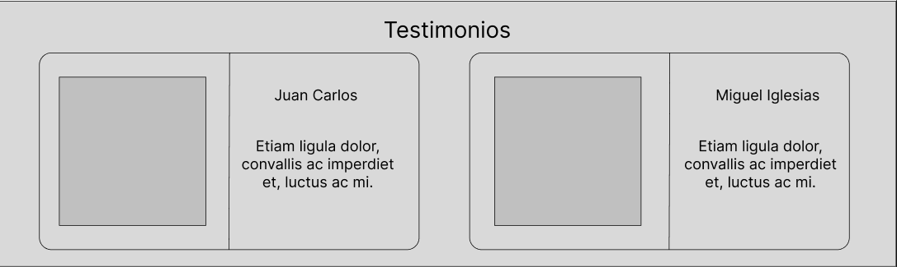

__Sección de Precio y Planes:__

Se detallan los distintos tipos de suscripciones disponibles para el usuario. Su función es permitir al usuario comparar los diferentes planes.

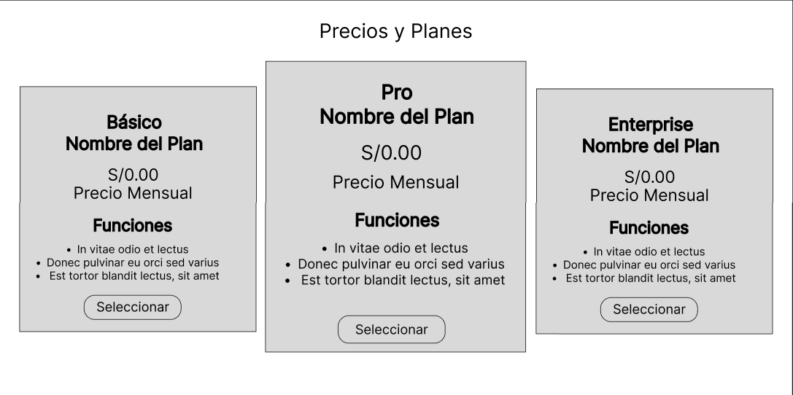

__Sección Capturas de Pantalla:__

Se muestran evidencias visuales del uso de nuestra aplicación. Su función informar al usuario de cómo se emplea nuestra aplicación

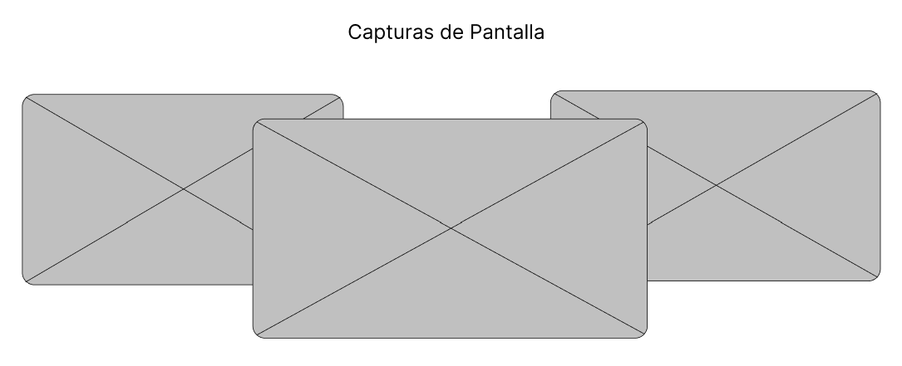

__Sección de Desarrolladores:__

Se mostrarán los encargados de haber desarrollado la aplicación.

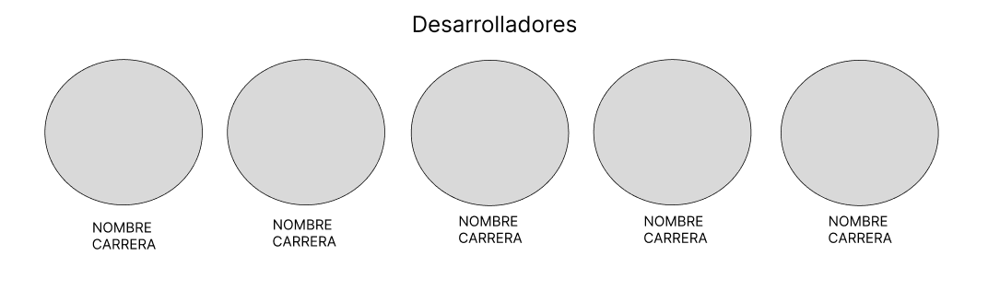

__Footer:__

Contiene información adicional como contactos, enlaces secundarios o derechos de autor. Su función es cerrar la navegación y ofrecer información complementaria.

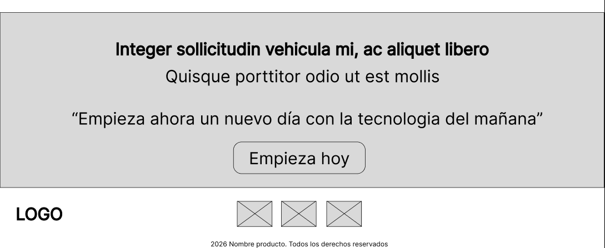

### Landing Page para Mobile Web Browser

__Header:__

Incluye el logotipo y un menú tipo hamburguesa. Su función es optimizar el espacio y mantener la navegación accesible.

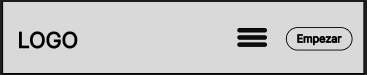

__Sección Principal Adaptada:__

Se presenta un mensaje clave sobre el sistema, acompañada de una imagen referencial y una boton de accion.

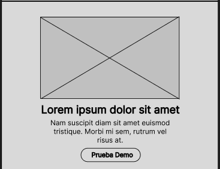

__Sección Beneficios:__

Presenta las principales ventajas del sistema en formato vertical mediante tarjetas

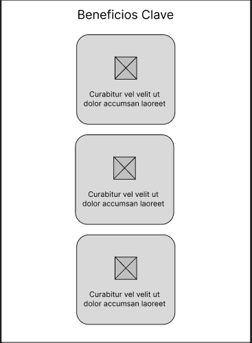

__Sección de Testimonios:__

Muestra experiencia de usuarios que han utilizado el sistema. Su función es generar confianza mediante opiniones de usuarios.

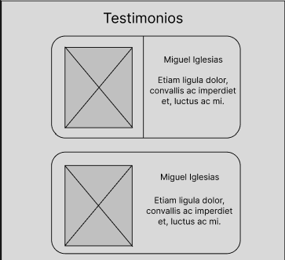

__Sección de Precio y Planes:__

Presenta los planes de suscripción disponibles en formato vertical. Su función es permitir al usuario comparar opciones y elegir la más adecuada.

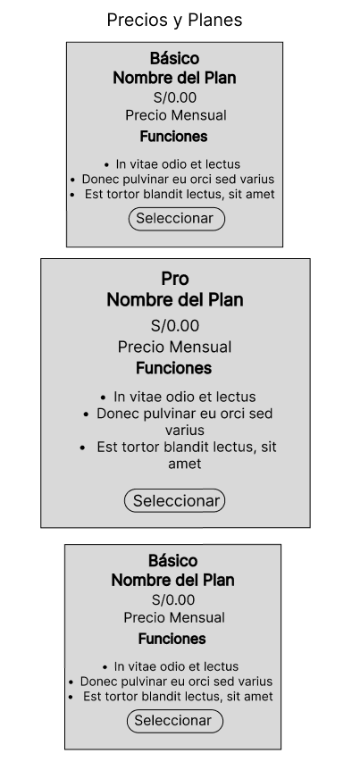

__Sección Capturas de Pantalla:__

Se muestran evidencias visuales del uso de nuestra aplicación. Su función es informar al usuario de cómo se emplea nuestra aplicación.

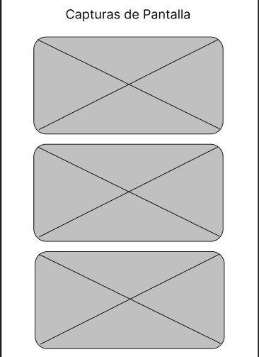

__Sección de Desarrolladores:__

Se mostrarán los encargados de haber desarrollado la aplicación.

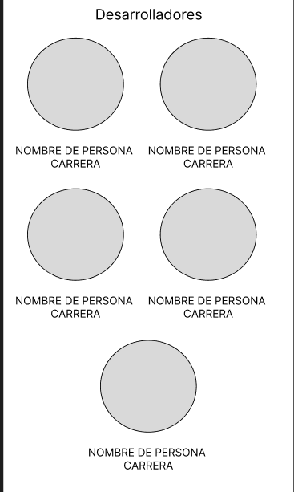

__Sección Footer:__

Sección final con información complementaria, enlaces y año de creación. Su función es brindar datos adicionales.

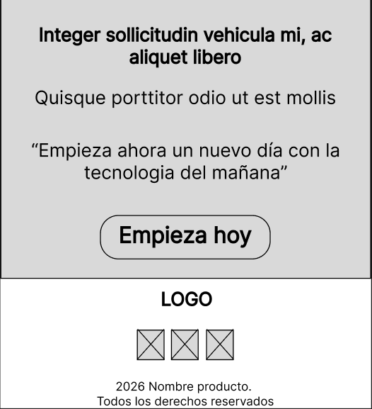

### 4.3.2. Landing Page Mock-up.

__Sección Encabezado:__

Presenta un diseño limpio de fondo blanco, logotipo de SIRAN en tono azules ubicado en la parte izquierda del menú de navegación y en el derecha (Home, Beneficios, Testimonios y Planes), acompañado del botón destacado.

__Sección Principal:__

Sección destacada con fondo grisáceo, un título principal en tipografía Poppins, texto descriptivos en tipografía Roboto y un botón en azul.. Se incluye una imagen representativa.

__Sección Beneficios:__

Se organiza en columnas con tarjetas que contiene iconos, título y descripciones cortas, utilizando un fondo azul lavanda en las tarjetas y un fondo blanco principal.

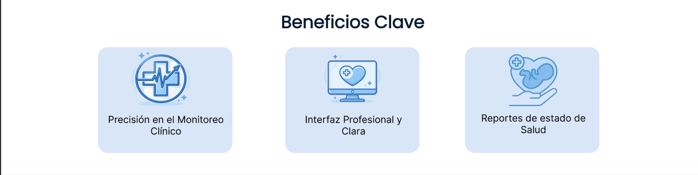

__Sección Testimonios:__

Tarjetas con fondo celeste pastel que contiene opiniones de usuarios, nombres e imágenes.

__Sección Precios y Planes:__

Tarjetas alineadas horizontalmente que presentan los planes de suscripción, con precios, características y botones. Se puede destacar un plan con color diferente.

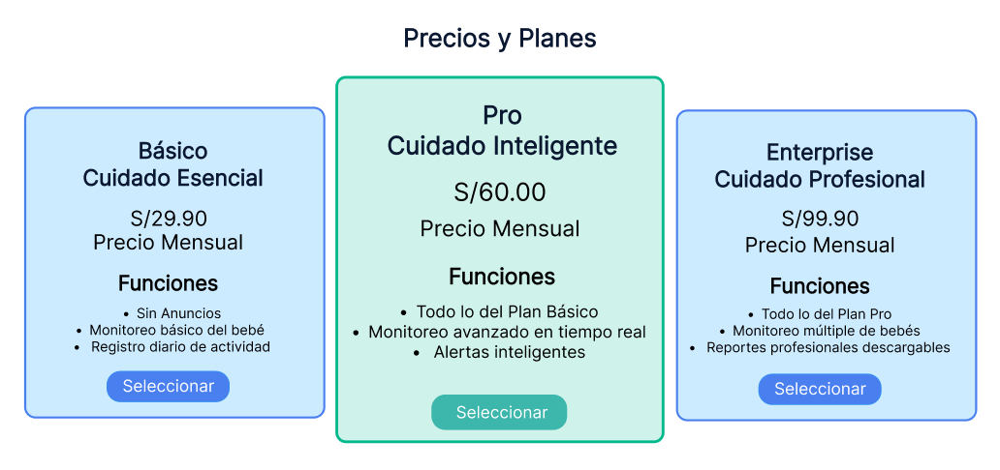

__Sección Capturas de Pantalla:__

Presentación visuales de nuestra aplicación con diferentes usuarios como los pediatras o padres.

__Sección de Desarrolladores:__

Se muestran a los encargados de haber desarrollado la 	aplicación.

__Sección Footer:__

Sección final con fondo blanco y celeste pastel, que incluye información adicional, enlaces y derechos de autor. Además de presentar enlaces a instagram y facebook.

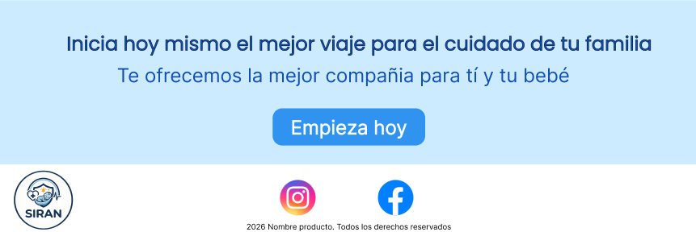

### Landing Page para Mobile Web Browser

__Sección Encabezado:__

Presenta un diseño de fondo blanco, el logotipo de SIRAN alineado al centro, un menú de hamburguesa alineado al lado izquierdo y por último un botón interactivo.

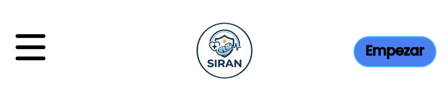

__Sección Principal:__

Se presenta en formato vertical con fondo en tonos grisáceos , un título destacado, texto breve y un botón CTA en azul.

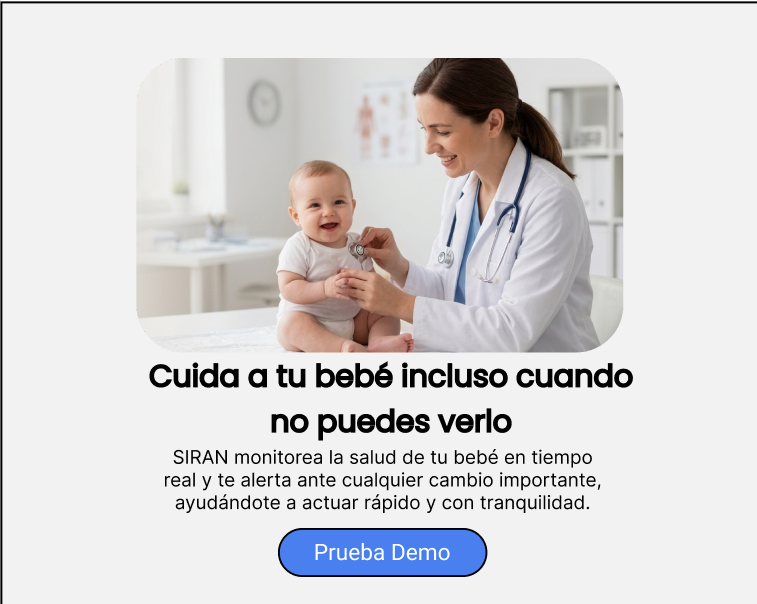

__Sección Beneficios:__

Organizada en tarjetas verticales con fondo blanco, cada una con icono, título y breve descripción.

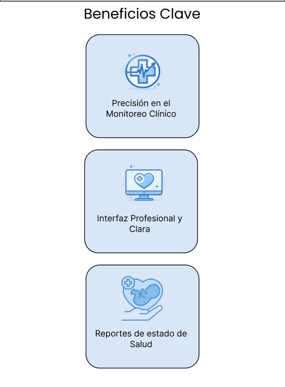

__Sección Testimonios:__

Tarjetas verticales con fondo celeste pastel, que contienen opiniones de usuarios con texto breve.

__Sección Planes:__

Tarjetas organizadas verticalmente con información de precios, características y botones de color azul brillante destacados. Ademas de que destaca la tarjeta del centro con un fondo de color cian pastel.

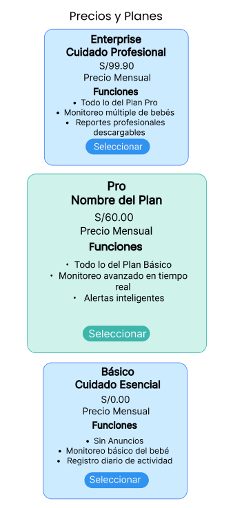

__Sección Capturas de Pantalla:__

Sección que evidencia el uso de nuestra aplicación y como los usuarios como pediatras o padres lo usan.

__Sección Desarrolladores:__

Se presenta mediante tarjetas con fondo blacno, donde se muestran los integrantes del equipo, incluyendo foto , nombre. Se mantiene el uso de colores suaves alineados a la identidad visual.

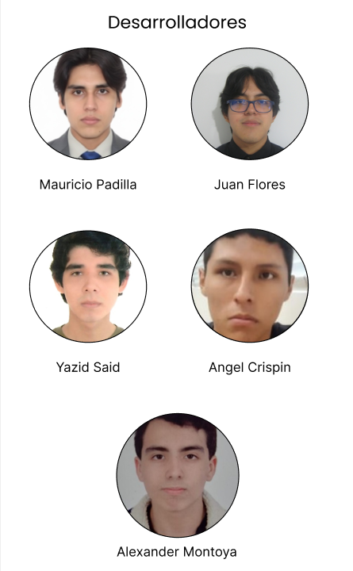

__Sección Footer:__

Presenta un diseño estructurado con fondo blacno y celeste pastel permitiendo diferenciarse del resto de secciones. Se organiza en bloques verticales , incluyendo enlaces de navegación y datos de contacto. Puede incorporar el logotipo en menor tamaño, acompañado de textos secundarios y enlaces útiles.

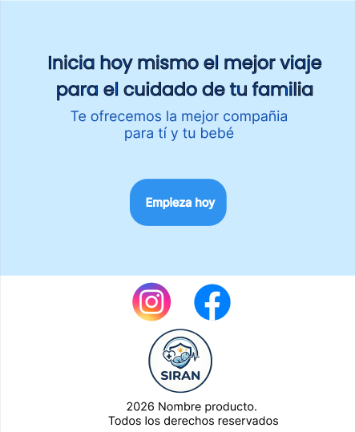
