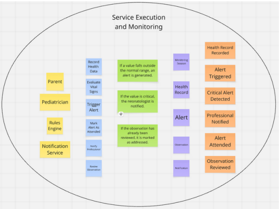

## 4.6. Domain-Driven Software Architecture

### 4.6.1. Design-Level Event Storming
6. Bounded Context Service Execution and Monitoring Neonatal
El bounded context Service Execution and Monitoring Neonatal constituye el núcleo operativo de SIRAN, encargado del monitoreo continuo y la supervisión del estado de salud del neonato. Su principal responsabilidad es procesar y analizar los datos clínicos registrados en tiempo real, validando los parámetros médicos y detectando posibles anomalías o situaciones de riesgo.

Este contexto gestiona la evaluación de signos vitales, la generación de alertas y el registro de eventos críticos, garantizando una respuesta rápida y confiable ante cualquier variación significativa en el estado del bebé. Asimismo, coordina la comunicación de información y resultados hacia otros contextos del sistema, facilitando la toma de decisiones oportunas por parte del personal médico y fortaleciendo el cuidado preventivo neonatal.

  

