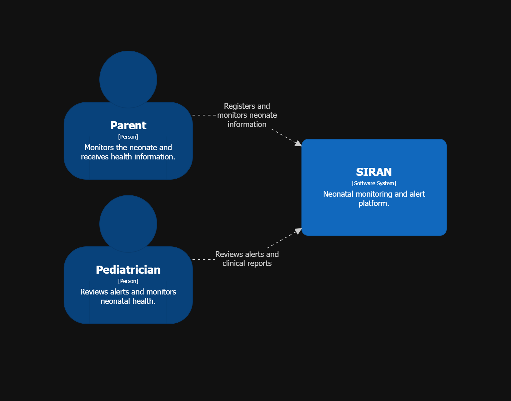
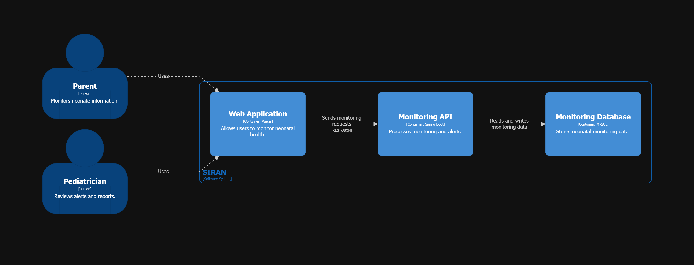
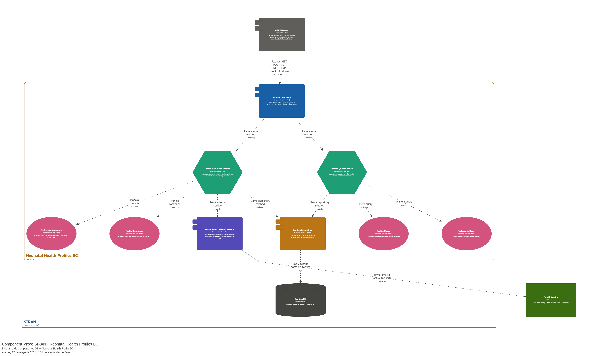

## 4.6. Domain-Driven Software Architecture

La arquitectura de software orientada al dominio en SIRAN es un enfoque de diseño estratégico que organiza la estructura del sistema en torno a los procesos críticos del cuidado neonatal. Este enfoque nos permite desarrollar una plataforma que refleja con exactitud la lógica clínica y los protocolos médicos de monitoreo, facilitando la implementación de funciones esenciales como los algoritmos de validación y la detección de señales de alerta temprana. Al centrar el diseño en el dominio de la salud infantil, garantizamos un sistema coherente, escalable y robusto, capaz de adaptarse a las normativas médicas cambiantes y de ofrecer una herramienta de mantenimiento sencillo que responde con precisión a los requisitos de seguridad y confiabilidad que el sector salud exige.

### 4.6.1. Design-Level Event Storming

La sesión de Design-Level Event Storming tuvo como propósito profundizar en el análisis del dominio y estructurar de manera detallada los componentes principales del sistema, tales como actores, comandos, eventos, políticas y agregados. Mediante una dinámica colaborativa desarrollada en Miro, se identificaron y organizaron los flujos esenciales del negocio, así como los distintos Bounded Contexts, permitiendo establecer una base sólida para el diseño arquitectónico de la solución.

### 4.6.2. Software Architecture Context Diagram

6. Service Execution and Neonatal Monitoring

The Context Diagram of the Service Execution and Neonatal Monitoring bounded context provides a high-level view of how SIRAN interacts with its primary users and external actors. This diagram illustrates the relationship between the neonatal monitoring platform and the stakeholders involved in the monitoring process, including parents and pediatricians.

The context view highlights how users interact with the system to register neonatal health information, review alerts, and access monitoring reports. It also demonstrates the role of SIRAN as a centralized platform that supports communication, supervision, and decision-making in neonatal care.

This representation helps define the system boundaries and clarifies the interactions between external actors and the monitoring ecosystem, ensuring a better understanding of the platform’s operational environment and responsibilities.

  

### 4.6.3. Software Architecture Container Diagrams

6. Service Execution and Neonatal Monitoring

The Container Diagram of the Service Execution and Neonatal Monitoring bounded context describes the main technological containers that compose the SIRAN platform and the interactions between them. This diagram illustrates how the frontend application, backend services, and database collaborate to support neonatal monitoring operations.

The architecture is divided into independent containers, including the Web Application developed with Vue.js, the Monitoring API implemented with Spring Boot, and the Monitoring Database responsible for storing clinical information and alerts. These containers communicate through RESTful interactions, enabling efficient processing and real-time access to neonatal monitoring data.

This design promotes scalability, separation of concerns, and maintainability by organizing the system into clearly defined layers. Additionally, it ensures a reliable flow of information between users, services, and data storage, supporting continuous monitoring and timely medical response within the SIRAN ecosystem.

  

### 4.6.4. Software Architecture Components Diagrams

6. Service Execution and Neonatal Monitoring

The Component Diagram of the Service Execution and Neonatal Monitoring bounded context represents the internal structure and interaction between the main components responsible for neonatal monitoring within SIRAN. This diagram illustrates how the system processes clinical information, validates vital signs, detects anomalies, and manages alerts in real time.

The architecture is organized into specialized components that collaborate to ensure continuous monitoring and efficient communication between services. Key components include the Monitoring Controller, Validation Service, Anomaly Detection Engine, Alert Manager, Notification Service, and repositories responsible for data persistence.

This design promotes modularity, scalability, and maintainability by separating responsibilities across independent services. Furthermore, it enables reliable coordination between monitoring processes and alert management, supporting timely medical intervention and improving the overall safety and quality of neonatal care.

Neonatal Health Profiles BC:

Service Execution and Neonatal Monitoring BC:

  

