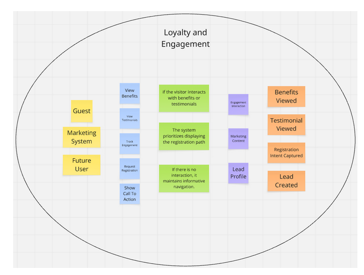

## 4.6. Domain-Driven Software Architecture

La arquitectura de software orientada al dominio en SIRAN es un enfoque de diseño estratégico que organiza la estructura del sistema en torno a los procesos críticos del cuidado neonatal. Este enfoque nos permite desarrollar una plataforma que refleja con exactitud la lógica clínica y los protocolos médicos de monitoreo, facilitando la implementación de funciones esenciales como los algoritmos de validación y la detección de señales de alerta temprana. Al centrar el diseño en el dominio de la salud infantil, garantizamos un sistema coherente, escalable y robusto, capaz de adaptarse a las normativas médicas cambiantes y de ofrecer una herramienta de mantenimiento sencillo que responde con precisión a los requisitos de seguridad y confiabilidad que el sector salud exige.

### 4.6.1. Design-Level Event Storming

La sesión de Design-Level Event Storming se realizó con el objetivo de refinar el modelo del dominio y detallar sus elementos clave, identificando actores, comandos, eventos, políticas y agregados. A través de un trabajo colaborativo en Miro, se organizaron los flujos principales del sistema y se definieron los Bounded Contexts, estableciendo una base clara para el diseño de la arquitectura.

El desarrollo del proceso se puede visualizar en el siguiente enlace: [Design-Level Event Storming]

#### 1. Bounded Context IAM

El bounded context Identity and Access Management se encarga de gestionar la identidad digital de los usuarios y controlar el acceso seguro a la plataforma. Su responsabilidad principal es garantizar que únicamente usuarios autenticados y autorizados puedan interactuar con las funcionalidades del sistema. Este contexto administra procesos como el registro de usuarios, autenticación, gestión de credenciales y control de roles. Además, establece las reglas de seguridad necesarias para proteger la información sensible, asegurando la confidencialidad e integridad de los datos dentro del ecosistema.

#### 2. Bounded Context Subscriptions and Payment Management

El bounded context Subscriptions and Payment Management gestiona todo lo relacionado con los modelos de suscripción y los procesos de pago dentro de la plataforma. Su objetivo es permitir que los usuarios accedan a diferentes niveles de servicio según el plan seleccionado. Este contexto administra la visualización de planes, la activación de suscripciones, la validación de transacciones y la gestión del estado de los pagos. Asimismo, garantiza que el acceso a funcionalidades avanzadas esté condicionado al estado de la suscripción del usuario.

#### 3. Bounded Context Profiles and Preferences Management

El bounded context Profiles and Preferences Management se encarga de la gestión de la información del usuario y de la configuración personalizada del sistema. Su propósito es adaptar el comportamiento de la plataforma a las características específicas de cada usuario y del neonato. Incluye la administración de perfiles, parámetros clínicos configurables y preferencias de notificación. Este contexto permite ajustar el sistema a diferentes escenarios, asegurando que las alertas y recomendaciones sean coherentes con las condiciones particulares de cada caso.

#### 4. Bounded Context Service Design and Planning

El bounded context Service Design and Planning se enfoca en la planificación del seguimiento clínico y la estructuración de las acciones que guían el monitoreo del neonato. Su objetivo es organizar de manera lógica y anticipada las actividades necesarias para el cuidado continuo. Este contexto permite definir esquemas de seguimiento, establecer prioridades de atención y estructurar recomendaciones basadas en el estado del neonato. Actúa como un componente estratégico que orienta la toma de decisiones y coordina las acciones dentro del sistema.

#### 5. Bounded Context Resource and Asset Management

El bounded context Resource and Asset Management gestiona los recursos de información generados dentro de la plataforma, especialmente los datos clínicos y registros asociados al neonato. Su finalidad es garantizar la correcta organización, almacenamiento y disponibilidad de la información. Incluye la administración de registros de salud, observaciones y documentos clínicos. Este contexto asegura la trazabilidad de los datos a lo largo del tiempo, permitiendo su consulta, análisis y reutilización en diferentes procesos del sistema.

#### 6. Bounded Context Service Execution and Monitoring

El bounded context Service Execution and Monitoring constituye el núcleo operativo del sistema, donde se ejecuta el monitoreo continuo del estado del neonato. Su responsabilidad es procesar los datos registrados, evaluar su validez y detectar posibles anomalías. Este contexto se encarga de la validación de parámetros, la generación de alertas y la gestión de eventos críticos. Además, coordina la comunicación de resultados hacia otros contextos, permitiendo una respuesta oportuna ante situaciones de riesgo.

#### 7. Bounded Context Dashboard and Analytics

El bounded context Dashboard and Analytics se encarga de transformar los datos registrados en información significativa para los usuarios. Su objetivo es facilitar la interpretación del estado del neonato mediante visualizaciones claras y análisis comprensibles. Incluye la generación de reportes, resúmenes y representaciones gráficas de la evolución del bebé. Este contexto permite identificar patrones, tendencias y comportamientos relevantes que apoyan la toma de decisiones tanto de padres como de profesionales de la salud.

#### 8. Bounded Context Loyalty and Engagement

El bounded context Loyalty and Engagement está orientado a la interacción inicial y continua con los usuarios, especialmente en la etapa de captación y generación de confianza. Su propósito es comunicar el valor de la plataforma y fomentar la adopción del sistema. Este contexto gestiona la presentación de beneficios, contenido informativo y elementos que fortalecen la credibilidad del producto. Además, contribuye a mejorar la experiencia del usuario, incentivando su permanencia y uso continuo de la plataforma.

### 4.6.2. Software Architecture Context Diagram

6. Service Execution and Neonatal Monitoring

The Context Diagram of the Service Execution and Neonatal Monitoring bounded context provides a high-level view of how SIRAN interacts with its primary users and external actors. This diagram illustrates the relationship between the neonatal monitoring platform and the stakeholders involved in the monitoring process, including parents and pediatricians.

The context view highlights how users interact with the system to register neonatal health information, review alerts, and access monitoring reports. It also demonstrates the role of SIRAN as a centralized platform that supports communication, supervision, and decision-making in neonatal care.

This representation helps define the system boundaries and clarifies the interactions between external actors and the monitoring ecosystem, ensuring a better understanding of the platform’s operational environment and responsibilities.

  

### 4.6.3. Software Architecture Container Diagrams

6. Service Execution and Neonatal Monitoring

The Container Diagram of the Service Execution and Neonatal Monitoring bounded context describes the main technological containers that compose the SIRAN platform and the interactions between them. This diagram illustrates how the frontend application, backend services, and database collaborate to support neonatal monitoring operations.

The architecture is divided into independent containers, including the Web Application developed with Vue.js, the Monitoring API implemented with Spring Boot, and the Monitoring Database responsible for storing clinical information and alerts. These containers communicate through RESTful interactions, enabling efficient processing and real-time access to neonatal monitoring data.

This design promotes scalability, separation of concerns, and maintainability by organizing the system into clearly defined layers. Additionally, it ensures a reliable flow of information between users, services, and data storage, supporting continuous monitoring and timely medical response within the SIRAN ecosystem.

  

### 4.6.4. Software Architecture Components Diagrams

6. Service Execution and Neonatal Monitoring

The Component Diagram of the Service Execution and Neonatal Monitoring bounded context represents the internal structure and interaction between the main components responsible for neonatal monitoring within SIRAN. This diagram illustrates how the system processes clinical information, validates vital signs, detects anomalies, and manages alerts in real time.

The architecture is organized into specialized components that collaborate to ensure continuous monitoring and efficient communication between services. Key components include the Monitoring Controller, Validation Service, Anomaly Detection Engine, Alert Manager, Notification Service, and repositories responsible for data persistence.

This design promotes modularity, scalability, and maintainability by separating responsibilities across independent services. Furthermore, it enables reliable coordination between monitoring processes and alert management, supporting timely medical intervention and improving the overall safety and quality of neonatal care.

  

