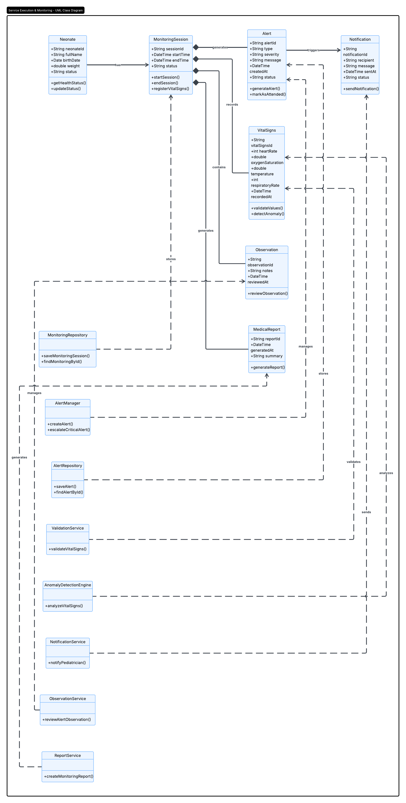

## 4.7. Software Object-Oriented Design

### 4.7.1. Class Diagrams

6. Bounded Context Service Execution and Monitoring Neonatal

The Class Diagram of the Service Execution and Neonatal Monitoring bounded context represents the internal domain model and the relationships between the main entities, services, and repositories that support the neonatal monitoring processes within SIRAN. This diagram defines the structural organization of the system and illustrates how data and responsibilities are distributed across the application.

The model includes core entities such as Neonate, MonitoringSession, VitalSigns, Alert, Notification, Observation, and MedicalReport, which together manage the registration, analysis, and supervision of neonatal health information. In addition, service classes such as ValidationService, AnomalyDetectionEngine, AlertManager, and NotificationService encapsulate the business logic required for parameter validation, anomaly detection, alert generation, and communication management.

The diagram also incorporates repository components responsible for data persistence, ensuring efficient storage and retrieval of monitoring information and alerts. This architecture promotes modularity, reusability, and maintainability by clearly separating domain entities, business logic, and persistence layers, enabling a scalable and reliable neonatal monitoring system.

  

