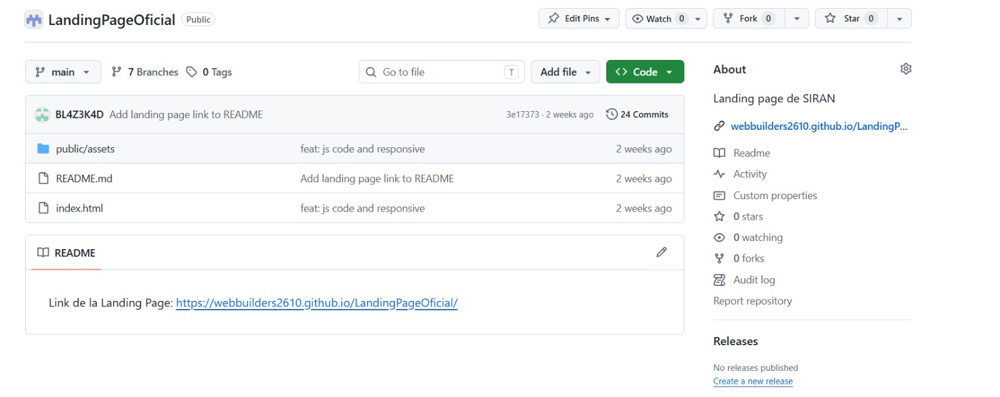
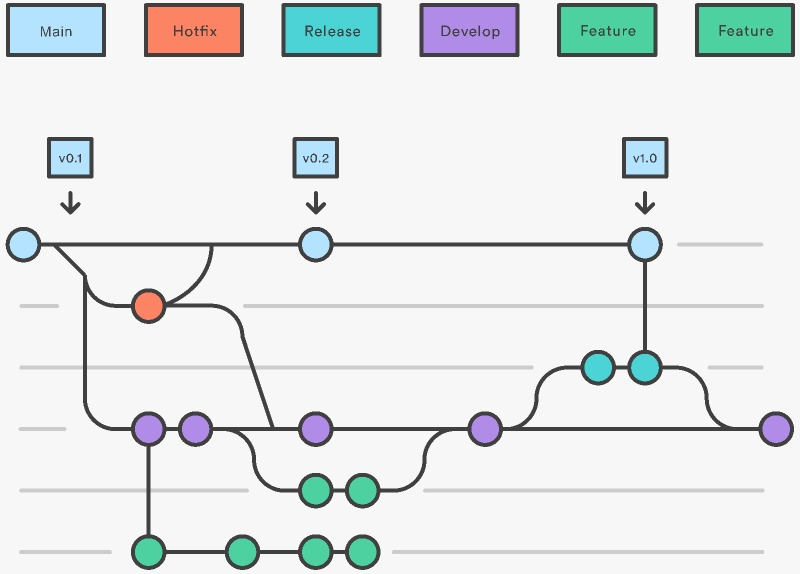
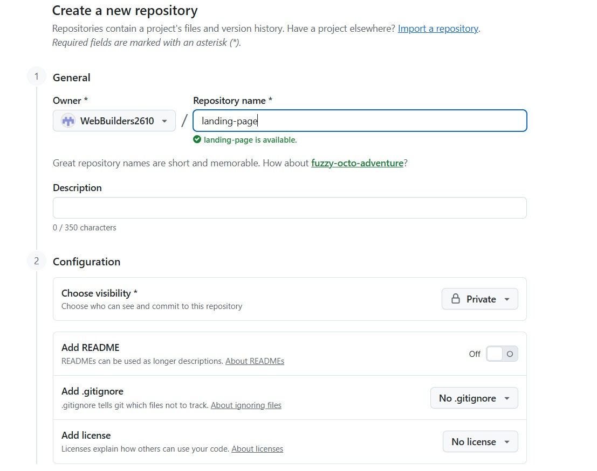
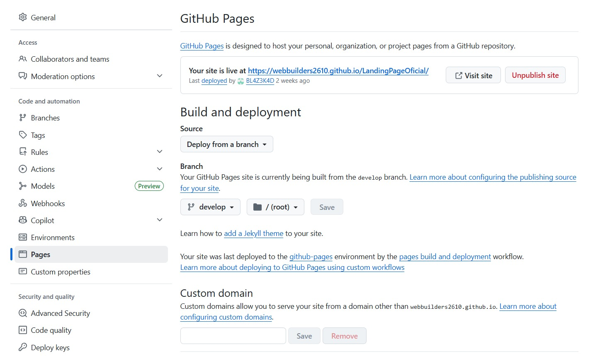

# Capítulo V: Product Implementation, Validation & Deployment

## 5.1. Software Configuration Management

## 5.1.1. Software Development Environment Configuration

Para el desarrollo del Sistema Inteligente de Registro y Alerta Neonatal (SIRAN), se utilizó un enfoque basado en tecnologías web estándar, priorizando la simplicidad, accesibilidad y facilidad de implementación, especialmente en la construcción de la Landing Page, la cual representa el primer punto de contacto con los usuarios.

### Landing Page Development

La Landing Page fue desarrollada utilizando **HTML, CSS y JavaScript**, lo que permitió construir una interfaz ligera, rápida y compatible con múltiples dispositivos sin depender de frameworks complejos. Esta decisión está alineada con el objetivo del proyecto de ofrecer una experiencia intuitiva y clara para padres y profesionales de la salud.

- **HTML** se utilizó para estructurar el contenido de la página, empleando etiquetas semánticas que mejoran la accesibilidad y el posicionamiento.
- **CSS** permitió diseñar una interfaz visual limpia, orientada a transmitir tranquilidad y confianza, aspectos clave para el contexto neonatal.
- **JavaScript** se utilizó para añadir interactividad básica, como navegación dinámica o mejoras en la experiencia del usuario.

Para el desarrollo, se utilizó **Visual Studio Code** como entorno de programación, debido a su ligereza, soporte para múltiples extensiones y herramientas integradas como autocompletado, resaltado de sintaxis y terminal.

Para el control de versiones y colaboración, se utilizó **Git** junto con **GitHub**, lo cual permitió:
- Mantener un historial organizado de cambios  
- Facilitar el trabajo colaborativo  
- Gestionar versiones del producto de manera eficiente  

### Herramientas utilizadas

- HTML  
- CSS  
- JavaScript  
- Visual Studio Code  
- Git  
- GitHub  

### Rutas de referencia

- GitHub: https://github.com  
- HTML: https://developer.mozilla.org/es/docs/Web/HTML  
- CSS: https://developer.mozilla.org/es/docs/Web/CSS  
- JavaScript: https://developer.mozilla.org/es/docs/Web/JavaScript  
- Visual Studio Code: https://code.visualstudio.com/  

---

## 5.1.2. Source Code Management

Para la gestión del código fuente del proyecto SIRAN se utilizó **Git** como sistema de control de versiones y **GitHub** como plataforma de alojamiento de repositorios.

Esto permitió organizar el desarrollo del proyecto, mantener trazabilidad de los cambios y facilitar la colaboración entre los integrantes del equipo.

### Repositorio del proyecto

Se creó un repositorio para la Landing Page del sistema:

- URL del repositorio:  
https://github.com/WebBuilders2610/LandingPageOficial



---
### Flujo de trabajo GitFlow:



### Estrategia de ramas

Se utilizó una estrategia basada en GitFlow simplificado:

#### Rama principal (`main`)

La rama `main` contiene las versiones **estables y funcionales** del proyecto. Únicamente se integran cambios previamente revisados y validados por el equipo. Esta rama representa la versión oficial desplegada de la solución.

---

#### Rama de desarrollo (`develop`)

La rama `develop` se utiliza para integrar todas las funcionalidades desarrolladas durante el Sprint antes de pasar a producción. Aquí se centralizan los avances colaborativos del equipo y se realizan validaciones generales de integración.

---

#### Ramas de funcionalidades (`feature`)

Cada funcionalidad o mejora del sistema se desarrolla en una rama independiente derivada de `develop`. Esto permite trabajar de forma paralela sin afectar la estabilidad del proyecto principal.

**La convención utilizada para nombrar las ramas sigue el patrón:**

- feature/nombre-funcionalidad

**Ejemplos:**

- feature/capturasdepantalla
- feature/code-js-to-menu
- feature/equipo

Una vez finalizada y validada la funcionalidad, la rama es fusionada hacia `develop` mediante **Pull Requests**.

---

#### Ramas de lanzamiento (`release`)

Las ramas `release` se utilizarán en futuras iteraciones para preparar versiones estables listas para producción. Estas ramas permitirán realizar pruebas finales, ajustes menores y validaciones antes de integrar cambios en `main`.

**La convención definida es:**

- release/vX.Y.Z

**Ejemplo:**

- release/v1.0.0

El versionamiento seguirá el estándar **Semantic Versioning 2.0.0**, considerando:

- `X` → cambios mayores incompatibles
- `Y` → nuevas funcionalidades compatibles
- `Z` → correcciones y mejoras menores

---

#### Ramas de corrección (`hotfix`)

Las ramas `hotfix` estarán destinadas a corregir errores críticos detectados en producción dentro de la rama `main`.

**La convención definida es:**

- hotfix/nombre-correccion

**Ejemplo:**

- hotfix/fix-navbar

Estas correcciones serán integradas tanto en `main` como en `develop` para mantener consistencia entre versiones.

---

### Convenciones de Commits

Para los mensajes de commits se aplicó el estándar **Conventional Commits**, basado en *Angular Commit Guidelines*. Esta convención facilita la lectura del historial de cambios y mejora la organización del proyecto.

#### Estructura utilizada

```bash
git commit -m "<type>: <description>"
```

#### Tipos de commits utilizados

| Tipo       | Descripción                        |
|------------|------------------------------------|
| `feat`     | Nueva funcionalidad                |
| `fix`      | Corrección de errores              |
| `style`    | Cambios visuales o de formato      |
| `refactor` | Reestructuración de código         |
| `docs`     | Cambios en documentación           |

#### Ejemplos

```bash
git commit -m "feat: implement landing page structure"
git commit -m "feat: add testimonials section"
git commit -m "style: improve responsive design"
git commit -m "fix: correct layout alignment"
```

---

### Beneficios de la estrategia aplicada

La implementación de **GitFlow** permitió:

- Organizar el trabajo colaborativo del equipo
- Mantener estabilidad en las versiones del proyecto
- Facilitar la integración continua
- Controlar cambios de manera estructurada
- Mejorar la trazabilidad de funcionalidades y correcciones
- Preparar el proyecto para futuras etapas de escalabilidad y despliegue continuo

## 5.1.3. Source Code Style Guide & Conventions

En esta sección se definen las convenciones de estilo adoptadas para asegurar la calidad, legibilidad y mantenibilidad del código del proyecto SIRAN.

### Convenciones generales

- Código limpio y bien indentado  
- Uso de nombres descriptivos  
- Evitar duplicación de código  
- Separación clara entre estructura, estilo y lógica  

---

### HTML

| Convención | Descripción |
|-----------|------------|
| Semántica | Uso de etiquetas como `header`, `main`, `section`, `footer` |
| Indentación | 2 espacios |
| Atributos | Uso de comillas dobles `"` |
| Nombres | kebab-case (`main-section`) |

**Buenas prácticas:**
- Evitar código innecesario o comentado  
- Uso de atributos `alt` en imágenes  
- Estructura clara y organizada  

---

### CSS

| Convención | Descripción |
|-----------|------------|
| Nombres de clases | kebab-case (`main-container`) |
| Organización | Agrupar estilos por secciones |
| Reutilización | Uso de clases reutilizables |
| Diseño | Enfoque responsive (mobile-first) |

**Buenas prácticas:**
- Evitar estilos inline  
- Mantener consistencia visual  
- Uso de variables CSS cuando sea necesario  

---

### JavaScript

| Convención | Descripción |
|-----------|------------|
| Variables | camelCase |
| Constantes | UPPER_SNAKE_CASE |
| Funciones | camelCase descriptivo |
| Organización | Separar lógica por funciones |

**Buenas prácticas:**
- Evitar código global innecesario  
- Uso de funciones reutilizables  
- Manejo claro de eventos  

---

## 5.1.4. Software Deployment Configuration

En esta sección se documenta el proceso de despliegue de la Landing Page del sistema SIRAN utilizando GitHub y GitHub Pages como plataforma de hosting y el proceso de despliegue para el Frontend Web Application utilizando Firebase.

### Despliegue de la Landing Page

Para que la Landing Page de SIRAN esté disponible para los usuarios, se realizó el despliegue mediante **GitHub Pages**, permitiendo publicar automáticamente el contenido del repositorio en un sitio web accesible desde internet.

---

#### 1. Registro y configuración en GitHub

Se creó una cuenta y organización en GitHub para almacenar y gestionar el código fuente del proyecto SIRAN. Posteriormente, se configuró el repositorio principal del proyecto para centralizar el desarrollo colaborativo.

---

#### 2. Creación del repositorio

- Se seleccionó la opción **"New Repository"** dentro de GitHub.
- El repositorio fue creado con el nombre:
  - `LandingPageOficial`
- El repositorio pertenece a la organización:
  - `WebBuilders2610`



---

#### 3. Configuración del repositorio

- El repositorio se configuró con **visibilidad pública** para facilitar el acceso y despliegue.
- Se agregó un archivo `README.md` inicial con información del proyecto.
- Se definió una estructura organizada de ramas utilizando **GitFlow simplificado**:
  - `main`
  - `develop`
  - `feature/*`
  - `bugfix/*`

---

#### 4. Carga del proyecto al repositorio

- Se desarrolló la Landing Page utilizando **HTML**, **CSS** y **JavaScript**.
- Los archivos del proyecto fueron subidos al repositorio mediante **Git**.
- Se realizaron commits utilizando la convención **Conventional Commits**.
- Los cambios fueron integrados progresivamente en la rama `develop` y posteriormente fusionados en `main`.


---

#### 5. Configuración de GitHub Pages

Para publicar la Landing Page se utilizó **GitHub Pages** siguiendo estos pasos:

- Se ingresó a la configuración del repositorio.
- En la sección **Pages**, se seleccionó:
  - Rama de despliegue: `main`
  - Carpeta raíz: `/root`
- GitHub generó automáticamente la URL pública del sitio web.

---

#### 6. Verificación del despliegue

Una vez configurado GitHub Pages, el sistema publicó automáticamente la Landing Page de SIRAN en producción.
 https://webbuilders2610.github.io/LandingPageOficial/

 Se verificó el correcto funcionamiento de:

- Navegación entre secciones
- Diseño responsive
- Visualización de testimonios
- Sección de planes
- Información de contacto
- Compatibilidad con navegadores modernos



---

#### 7. Actualización automática del sitio

El flujo de actualización del sitio quedó definido de la siguiente manera:

1. Realizar cambios en el proyecto local.
2. Ejecutar commits utilizando Git.
3. Hacer push al repositorio remoto en GitHub.
4. Fusionar cambios hacia la rama `main`.
5. GitHub Pages despliega automáticamente la nueva versión.

Este flujo permitió mantener una **integración continua simple y eficiente** durante el desarrollo del Sprint.

---

### Consideraciones del despliegue

- La Landing Page es accesible desde cualquier navegador moderno.
- No requiere instalación adicional por parte del usuario.
- El despliegue es automático al actualizar la rama principal.
- La solución permite futuras integraciones con backend y servicios inteligentes.
- GitHub Pages ofrece una alternativa gratuita y estable para aplicaciones web estáticas.
