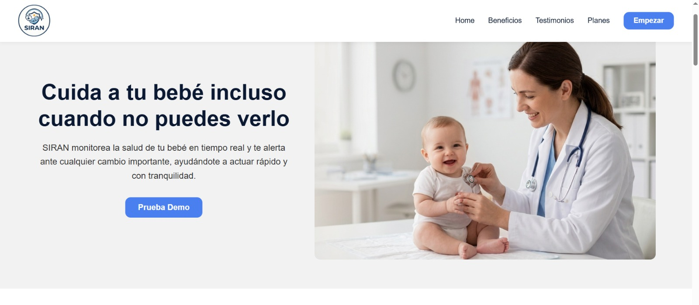
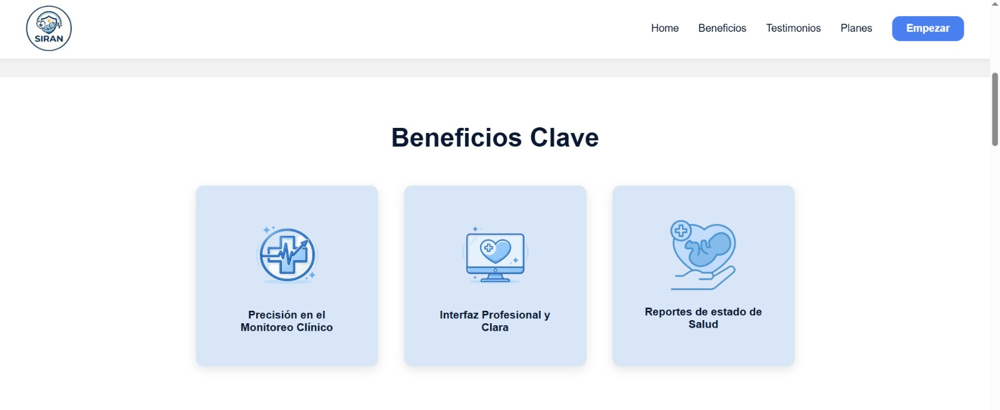
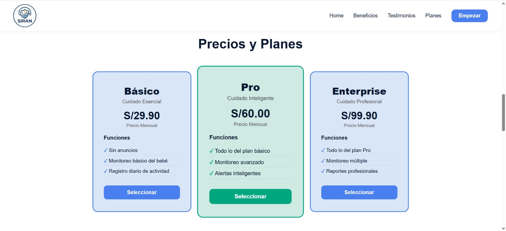

## 5.2. Landing Page, Services & Applications Implementation
En esta sección se documenta el proceso de implementación, pruebas, documentación y despliegue del Landing Page, los Web Services y las Frontend Web Applications desarrolladas para SIRAN. Asimismo, se registra el avance alcanzado en cada Sprint, tanto en términos de producto como de trabajo colaborativo del equipo Scrum.

El objetivo principal de esta sección es evidenciar el desarrollo incremental de la solución tecnológica, mostrando cómo las funcionalidades fueron construidas y validadas progresivamente a través de las iteraciones definidas en el Product Backlog.

Cada Sprint incluye los siguientes apartados:

- **Sprint Planning:** descripción de la planificación realizada, incluyendo objetivos, velocity, historias de usuario y acuerdos principales del Sprint.
- **Aspect Leaders and Collaborators:** matriz Leadership-and-Collaboration Matrix (LACX), donde se asignan líderes y colaboradores para cada aspecto funcional y técnico considerado en el Sprint.
- **Sprint Backlog:** conjunto de historias de usuario y tareas comprometidas para la iteración.
- **Development Evidence for Sprint Review:** evidencias del desarrollo implementado.
- **Execution Evidence for Sprint Review:** evidencias de ejecución y validación funcional.
- **Services Documentation Evidence for Sprint Review:** documentación técnica de servicios y endpoints implementados.
- **Team Collaboration Insights during Sprint:** reflexiones y evidencias del trabajo colaborativo del equipo.


### 5.2.1. Sprint 1

En esta sección se presenta la documentación correspondiente al Sprint 1 del proyecto SIRAN. Durante esta iteración se desarrolló la estructura inicial de la Landing Page y se establecieron las bases de la aplicación web y servicios necesarios para el monitoreo neonatal.

El Sprint 1 estuvo enfocado en implementar la identidad visual de la plataforma, las secciones informativas principales orientadas a padres y especialistas neonatales, así como la configuración inicial del entorno de desarrollo y despliegue colaborativo.


#### 5.2.1.1. Sprint Planning 1
| Sprint # | Sprint 1 |
|---|---|
| **Sprint Planning Background** |  |
| Date | 2026-04-20 |
| Time | 08:00 PM |
| Location | Virtual (Discord) |
| Prepared By | Montoya Torres, Alexander Gabriel |
| Attendees (to planning meeting) | Montoya Torres, Alexander Gabriel / Padilla Merino, Mauricio Jared / Flores Rios, Juan Diego / Crispin Valdivia, Angel Gabriel / Sebastian [Apellido] / Jose Carlos [Apellido] |
| Sprint 0 Review Summary | No aplica debido a que corresponde al primer Sprint del proyecto. |
| Sprint 0 Retrospective Summary | No aplica debido a que corresponde al primer Sprint del proyecto. |
| Sprint Goal & User Stories | |
| Sprint 1 Goal | Nuestro objetivo es implementar la página de inicio de SIRAN y establecer la arquitectura base para la plataforma de monitorización neonatal. Creemos que ofrece información accesible y fiable a padres y neonatólogos, a la vez que proporciona al equipo de desarrollo una base tecnológica sólida para futuras iteraciones. Esto se confirmará cuando los usuarios puedan navegar correctamente por las secciones de la página de inicio y el entorno de desarrollo esté completamente configurado e implementado de forma colaborativa. |
| Sprint 1 Velocity | 20 Story Points |
| Sum of Story Points | 20 Story Points |

#### 5.2.1.2. Aspect Leaders and Collaborators
En esta sección se presenta la Leadership-and-Collaboration Matrix (LACX) correspondiente al Sprint 1. Esta matriz define los roles de liderazgo y colaboración asignados a cada integrante del equipo en relación con los aspectos principales considerados durante el desarrollo de la iteración.

Para este Sprint, se identificaron los siguientes aspectos principales:

### Principales Aspectos Considerados en el Sprint

#### Landing Page (Frontend Web Development)

Comprende el diseño e implementación de la interfaz principal de SIRAN, incluyendo la estructura visual, navegación, diseño responsive y secciones informativas dirigidas a padres y especialistas neonatales.

#### Deployment & Repository Management

Incluye la configuración del repositorio colaborativo, control de versiones, despliegue inicial y administración de entornos de trabajo del equipo.

La organización de líderes y colaboradores permitió distribuir responsabilidades de manera equilibrada, favoreciendo la comunicación efectiva y el desarrollo colaborativo durante el Sprint.

| Team Member (Last Name, First Name) | GitHub Username | Landing Page (L/C) | Services (L/C) | Applications (L/C) | Deployment (L/C) |
|---|---|---|---|---|---|
| Montoya Torres, Alexander Gabriel | gabrielito4334 | L | C | C | C |
| Padilla Merino, Mauricio Jared | MauricioPadilla07 | C | L | C | C |
| Flores Rios, Juan Diego | YopoFlores | C | C | L | C |
| Crispin Valdivia, Angel Gabriel  | FaureGalliard | C | C | C | L |
| Sebastian [Apellido] | sebastian-dev | C | C | C | C |
| Jose Carlos [Apellido] | josec-dev | C | C | C | C |

#### 5.2.1.3. Sprint Backlog 1

El Sprint Backlog 1 se centra en la implementación inicial de la Landing Page de SIRAN, priorizando la construcción de las principales secciones informativas orientadas a padres primerizos y especialistas neonatales. Durante este Sprint, el equipo trabajó colaborativamente en el desarrollo de la interfaz web, navegación, contenido institucional y diseño responsive, asegurando una experiencia clara, accesible y alineada con los objetivos de la startup.

A continuación, se detallan las User Stories y las Tasks asignadas a cada miembro del equipo, junto con su estado actual.

| **User Story Id** | **User Story Title**                       | **Task Id** | **Task Title**                     | **Description**                                                                            | **Estimation (Hours)** | **Assigned To** | **Status** |
| ----------------- | ------------------------------------------ | ----------- | ---------------------------------- | ------------------------------------------------------------------------------------------ | ---------------------- | --------------- | ---------- |
| HU01              | Ver información de la plataforma           | T-01        | Maquetar sección principal         | Implementar estructura principal de la Landing Page con información introductoria de SIRAN | 4                      | Alexander       | Done       |
| HU01              | Ver información de la plataforma           | T-02        | Redactar contenido informativo     | Elaborar textos descriptivos sobre beneficios y funcionalidades de la plataforma           | 3                      | Said            | Done       |
| HU04              | Visualizar misión y visión institucional   | T-03        | Implementar sección institucional  | Diseñar e implementar sección de misión y visión de la startup                             | 2                      | Ángel Gabriel   | Done       |
| HU05              | Navegar entre secciones de la Landing Page | T-04        | Configurar menú de navegación      | Implementar barra de navegación con enlaces internos entre secciones                       | 3                      | Juan Diego      | Done       |
| HU05              | Navegar entre secciones de la Landing Page | T-05        | Implementar navegación responsive  | Adaptar navegación para dispositivos móviles y tablets                                     | 2                      | Said            | Done       |
| HU06              | Visualizar contenido responsive            | T-06        | Ajustar diseño responsive          | Optimizar visualización de componentes en desktop, tablet y móvil                          | 4                      | Ángel Gabriel   | Done       |
| HU07              | Visualizar beneficios del sistema          | T-07        | Crear sección de beneficios        | Implementar cards informativas sobre funcionalidades principales de SIRAN                  | 3                      | Alexander       | Done       |
| HU02              | Ver testimonios                            | T-08        | Implementar sección de testimonios | Diseñar bloque de testimonios de padres y especialistas                                    | 2                      | Said            | Done       |
| HU03              | Ver planes                                 | T-09        | Diseñar sección de planes          | Crear estructura visual para los planes y funcionalidades disponibles                      | 3                      | Juan Diego      | Done       |
| HU08              | Acceder a información de contacto          | T-10        | Implementar footer de contacto     | Agregar correo electrónico, teléfono y enlaces de contacto                                 | 2                      | Alexander       | Done       |
| HU08              | Acceder a información de contacto          | T-11        | Configurar enlaces interactivos    | Implementar enlaces `mailto:` y accesos directos de comunicación                           | 1                      | Juan Diego      | Done       |
| HU09              | Visualizar preguntas frecuentes            | T-12        | Crear sección FAQ                  | Diseñar e implementar preguntas frecuentes sobre el sistema                                | 2                      | Ángel Gabriel   | Done       |
| HU10              | Acceder a llamadas a la acción             | T-13        | Implementar botones CTA            | Agregar botones de registro y acceso rápido a la plataforma                                | 2                      | Alexander       | Done       |
| TS05              | Implementación de Landing Page             | T-14        | Configurar estructura del proyecto | Inicializar proyecto frontend y configurar dependencias                                    | 3                      | Said            | Done       |
| TS05              | Implementación de Landing Page             | T-15        | Configurar estilos globales        | Implementar estilos base y paleta visual institucional                                     | 3                      | Juan Diego      | Done       |
| TS05              | Implementación de Landing Page             | T-16        | Integrar componentes frontend      | Conectar las distintas secciones desarrolladas en una sola Landing Page                    | 4                      | Alexander       | Done       |
| TS05              | Implementación de Landing Page             | T-17        | Pruebas de visualización           | Verificar correcta visualización y funcionamiento de la Landing Page                       | 2                      | Ángel Gabriel   | Done       |
| TS05              | Implementación de Landing Page             | T-18        | Despliegue inicial del proyecto    | Publicar la versión inicial de la Landing Page en entorno de despliegue                    | 2                      | Said            | Done       |


#### 5.2.1.4. Development Evidence for Sprint Review
En esta sección se presenta la evidencia del desarrollo realizado durante el Sprint 1 del proyecto SIRAN (Sistema Inteligente de Registro y Alerta Neonatal). Durante este sprint, el equipo se enfocó principalmente en la implementación de la Landing Page informativa, la cual representa el primer punto de contacto entre la plataforma y los usuarios potenciales, incluyendo padres y profesionales neonatales.

El desarrollo de la Landing Page se realizó utilizando tecnologías web estándar como HTML, CSS y JavaScript, priorizando simplicidad, rendimiento y compatibilidad con múltiples dispositivos. Asimismo, se utilizó Visual Studio Code como entorno de desarrollo y GitHub para la gestión colaborativa del código fuente y control de versiones.

Durante este Sprint se implementaron las funcionalidades principales relacionadas con:

Estructura inicial de la Landing Page
Sección de beneficios y funcionalidades de SIRAN
Sección de testimonios y planes
Navegación dinámica entre secciones
Diseño responsive para distintos dispositivos
Footer y sección de contacto
Optimización visual y mejoras de accesibilidad

El equipo trabajó bajo una estrategia de ramas basada en GitFlow simplificado, desarrollando funcionalidades en ramas feature antes de integrarlas en la rama develop.
| **Repository**                     | **Branch**                 | **Commit Id** | **Commit Message**                      | **Commit Message Body**                                                       | **Committed on (Date)** |
| ---------------------------------- | -------------------------- | ------------- | --------------------------------------- | ----------------------------------------------------------------------------- | ----------------------- |
| WebBuilders2610/LandingPageOficial | develop                    | a12fd31       | feat: implement landing page structure  | Added initial HTML structure and semantic sections for the SIRAN Landing Page | 2026-04-21              |
| WebBuilders2610/LandingPageOficial | feature/capturasdepantalla | b45ca22       | feat: add screenshots section           | Implemented screenshots section showing system interface previews             | 2026-04-21              |
| WebBuilders2610/LandingPageOficial | feature/code-js-to-menu    | c88de19       | feat: implement dynamic navigation menu | Added JavaScript functionality for responsive navigation menu behavior        | 2026-04-21              |
| WebBuilders2610/LandingPageOficial | feature/equipo             | d51ab73       | feat: add team section                  | Implemented team members section with cards and responsive structure          | 2026-04-21              |
| WebBuilders2610/LandingPageOficial | feature/pricing            | e20fd11       | feat: add pricing section               | Added pricing and plans section for visitors                                  | 2026-04-21              |
| WebBuilders2610/LandingPageOficial | feature/testimonios        | f73aa54       | feat: implement testimonials section    | Added testimonials section with responsive cards and user feedback            | 2026-04-21              |
| WebBuilders2610/LandingPageOficial | develop                    | g41cc28       | style: improve responsive design        | Improved responsive visualization for desktop, tablet and mobile devices      | 2026-04-21              |
| WebBuilders2610/LandingPageOficial | develop                    | h92fd67       | fix: correct layout alignment           | Fixed spacing, alignment issues and improved overall visual consistency       | 2026-04-21              |


#### 5.2.1.5. Execution Evidence for Sprint Review
En esta sección se presenta la evidencia del desarrollo realizado durante el **Sprint 1** del proyecto **SIRAN** (Sistema Inteligente de Registro y Alerta Neonatal). Durante este sprint, el equipo se enfocó principalmente en la implementación de la **Landing Page informativa**, la cual representa el primer punto de contacto entre la plataforma y los usuarios potenciales, incluyendo padres y profesionales neonatales.

El desarrollo de la Landing Page se realizó utilizando tecnologías web estándar como **HTML**, **CSS** y **JavaScript**, priorizando simplicidad, rendimiento y compatibilidad con múltiples dispositivos. Asimismo, se utilizó **Visual Studio Code** como entorno de desarrollo y **GitHub** para la gestión colaborativa del código fuente y control de versiones.

Durante este Sprint se implementaron las funcionalidades principales relacionadas con:

- Estructura inicial de la Landing Page
- Sección de beneficios y funcionalidades de SIRAN
- Sección de testimonios y planes
- Navegación dinámica entre secciones
- Diseño responsive para distintos dispositivos
- Footer y sección de contacto
- Optimización visual y mejoras de accesibilidad


A continuación, se presentan capturas de pantalla de las vistas principales implementadas durante el Sprint:

**Vista principal de la Landing Page**



**Sección de beneficios del sistema**


**Sección de testimonios**


**Sección de planes**


**Vista responsive en dispositivos móviles**


#### 5.2.1.6. Services Documentation Evidence for Sprint Review

Durante el **Sprint 1** no se desarrollaron Web Services ni endpoints RESTful, debido a que el alcance del Sprint estuvo centrado exclusivamente en la implementación de la Landing Page informativa del sistema SIRAN.

Por ello, no se generó documentación OpenAPI ni especificaciones Swagger relacionadas con servicios backend.

Sin embargo, durante este Sprint se definieron las bases funcionales y técnicas necesarias para la futura implementación de APIs relacionadas con:

- Registro de parámetros neonatales
- Gestión de alertas inteligentes
- Consulta de historial clínico
- Generación de reportes médicos

Estas funcionalidades serán abordadas en Sprints posteriores.

#### 5.2.1.7. Software Deployment Evidence for Sprint Review
Durante el **Sprint 1**, el equipo implementó el despliegue de la Landing Page de SIRAN utilizando **GitHub Pages** como plataforma de hosting web estático.

La estrategia de despliegue permitió publicar rápidamente el sitio web y mantener integración directa con el repositorio principal del proyecto alojado en GitHub.

### Estrategia de despliegue implementada

Se utilizó un enfoque de despliegue simple y eficiente basado en:

- GitHub
- GitHub Pages
- Integración automática desde la rama `main`

Esta configuración permitió automatizar parcialmente el proceso de publicación y asegurar disponibilidad continua del sitio web.

### Proceso de despliegue realizado

#### 1. Creación y configuración del repositorio
- Se creó el repositorio oficial del proyecto.

   https://github.com/WebBuilders2610/LandingPageOficial
  
- Se configuró la estructura inicial del proyecto y control de versiones con Git.
#### 2. Configuración de GitHub Pages

- Se accedió a la configuración del repositorio en GitHub.
- Se habilitó GitHub Pages como servicio de hosting.
- Se seleccionó la rama `main` como fuente de despliegue.

#### 3. Publicación del sitio

- Cada actualización integrada en la rama principal fue publicada automáticamente.
- Se validó la visualización correcta en navegadores modernos y dispositivos móviles.

    https://webbuilders2610.github.io/LandingPageOficial/

---
#### 5.2.1.8. Team Collaboration Insights during Sprint

Durante el **Sprint 1**, el equipo de desarrollo de SIRAN mantuvo una colaboración activa y organizada, permitiendo cumplir satisfactoriamente con los objetivos establecidos para la implementación de la Landing Page.

La coordinación del trabajo se realizó mediante **GitHub** y reuniones periódicas de seguimiento, permitiendo distribuir tareas y mantener un flujo constante de integración de cambios.

### Metodología de trabajo colaborativo

El equipo utilizó una estrategia basada en **GitFlow simplificado**, donde:

- La rama `main` almacenó versiones estables
- La rama `develop` integró avances generales
- Las ramas `feature` permitieron desarrollar funcionalidades específicas

Cada integrante trabajó sobre funcionalidades asignadas y posteriormente integró sus cambios mediante commits organizados y descriptivos.

### Actividades colaborativas realizadas

#### 1. Desarrollo por funcionalidades

Cada integrante trabajó en módulos específicos como:

- Navegación y estructura HTML
- Diseño responsive
- Secciones informativas
- Footer y contacto
- Optimización visual

#### 2. Control de versiones

Se utilizaron commits siguiendo la convención **Conventional Commits**:

```bash
git commit -m "feat: add testimonials section"
git commit -m "fix: improve responsive layout"
git commit -m "style: update footer design"
```

#### 3. Comunicación del equipo

La coordinación se realizó mediante:

- **Discord** para reuniones y seguimiento
- **GitHub** para revisión de avances
- Organización de tareas mediante **Sprint Backlog**

### Participación del equipo

Todos los integrantes participaron activamente en la implementación de la Landing Page, contribuyendo mediante desarrollo, diseño, integración y pruebas visuales.

### Herramientas colaborativas utilizadas

- Git
- GitHub
- Visual Studio Code
- Discord
